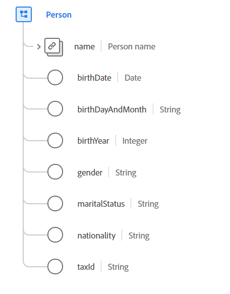

# [!UICONTROL Person] data type

[!UICONTROL Person] is a standard Experience Data Model (XDM) data type that describes an individual person. This datatype can represent a person acting in various roles, such as a customer, contact, or owner.

 

| Property | Data type | Description |
| --- | --- | --- |
| `name` | [[!UICONTROL Person name]](./person-name.md) | Describes details about the person's full name. |
| `birthDate` | Date | The full date a person was born. The date format (without time) should follow the [RFC 3339, section 5.6](https://tools.ietf.org/html/rfc3339#section-5.6) standard. |
| `birthDayAndMonth` | String | The day and month a person was born, in the format MM-DD. This field should be used when the day and month of a person's birth is known, but not the year. The format of this property must conform to this regular expression `[0-1][0-9]-[0-9][0-9]`. |
| `birthYear` | Integer | The year a person was born including the century (for example, `1983`). This field should be used when only the person's age is known and not the full birth date. This value must be between 1 and 32767. |
| `gender` | String | The gender identity of the person. The value of this property must be equal to one of the following known enum values. <li> `female` </li> <li> `male` </li> <li> `not_specified` </li> <li> `non_specific` </li> The default for this value is `not_specified`. |
| `maritalStatus` | String | Describes a person's relationship with a significant other. The value of this property must be equal to one of the following enum values. <li> `married` </li> <li> `single` </li> <li> `divorced` </li> <li> `widowed` </li> <li> `not_specified` </li> The default for this value is `not_specified`. |
| `nationality` | String | The legal relationship between a person and their state represented using the ISO 3166-1 Alpha-2 code. The format of this property must conform to this regular expression `^[A-Z]{2}$`. |
| `taxId` | String | The tax or fiscal ID of the person, such as the Taxpayer Identification Number (TIN) in the US or the Certificado de Identificación Fiscal (CIF/NIF) in Spain. |

{style="table-layout:auto"}

For more details on the data type, refer to the public XDM repository:

* [Populated example](https://github.com/adobe/xdm/blob/master/components/datatypes/person/person.example.1.json)
* [Full schema](https://github.com/adobe/xdm/blob/master/components/datatypes/person/person.schema.json)
