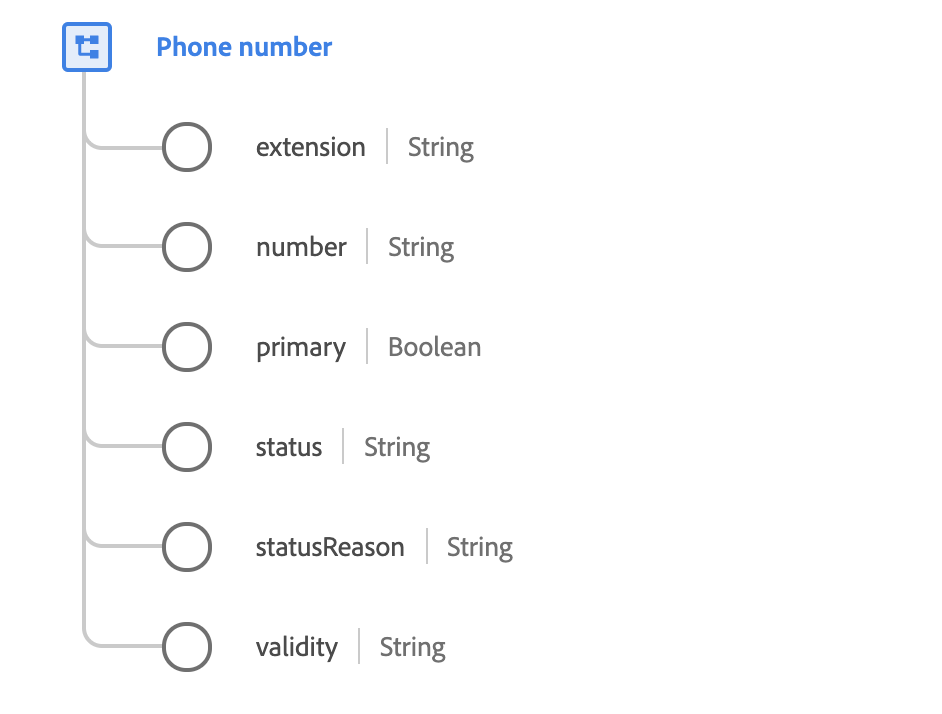

# [!UICONTROL Phone number] data type

[!UICONTROL Phone number] is a standard XDM data type that describes the details of a phone number.

 

| Property | Description |
| --- | --- |
| `extension` | The internal dialing number used to call from a private exchange, operator, or switchboard. |
| `number` | The phone number. Note the phone number is a string and may include meaningful characters such as brackets `()`, hyphens `-`, or characters to indicate sub-dialing identifiers like extensions `x` for example, `1-353(0)18391111` or `+613 9403600x1234`. |
| `primary` | A Boolean value that indicates whether this is the individual's primary phone number. Unlike address or email address, there can be multiple primary phone numbers; one per communication channel. The communication channel is defined by the type (indicated by the name of the parent property): `textMessaging`, `mobile`, `phone`, `home`, `work`, `unknown`, and `fax`. |
| `status` | Indicates whether the phone number can be currently used. |
| `statusReason` | A description of the current status. |
| `validity` | A level of technical correctness of the phone number. |

{style="table-layout:auto"}

For more details on the phone number data type, refer to the public XDM repository:

* [Populated example](https://github.com/adobe/xdm/blob/master/components/datatypes/demographic/phonenumber.example.1.json)
* [Full schema](https://github.com/adobe/xdm/blob/master/components/datatypes/demographic/phonenumber.schema.json)
