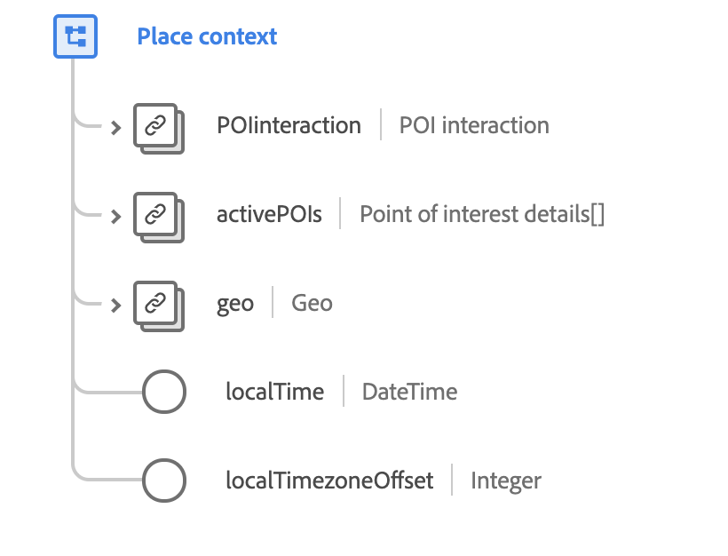

# [!UICONTROL Place context] data type

[!UICONTROL Place context] is a standard XDM data type that describes the location of an observed event, including point-of-interest information and geographical coordinates.

 

| Property | Data type | Description |
| --- | --- | --- |
| `POIinteraction` | [[!UICONTROL Point of interest interaction]](./poi-interaction.md) | Describes details about the point-of-interest (POI) interaction. |
| `activePOIs` | Array of [[!UICONTROL Point of interest details]](./poi-details.md) | Describes the POIs that caused the event. |
| `geo` | [[!UICONTROL Geo]](./geo.md) | Describes the geographic location where the experience was delivered. |
| `localTime` | DateTime | A timestamp in [RFC 3339](https://tools.ietf.org/html/rfc3339) format, indicating the local time using with a stated time zone offset. The formatting pattern is `yyyy-MM-dd'T'HH:mm:ssXXX` (for example, `2001-07-04T12:08:56-07:00`). |
| `localTimezoneOffset` | Integer | The current local timezone offset in minutes from UTC for the `localTime` value. This should include the current DST offset if applicable. |

{style="table-layout:auto"}

For more details on the data type, refer to the public XDM repository:

* [Populated example](https://github.com/adobe/xdm/blob/master/components/datatypes/placecontext.example.1.json)
* [Full schema](https://github.com/adobe/xdm/blob/master/components/datatypes/placecontext.schema.json)
