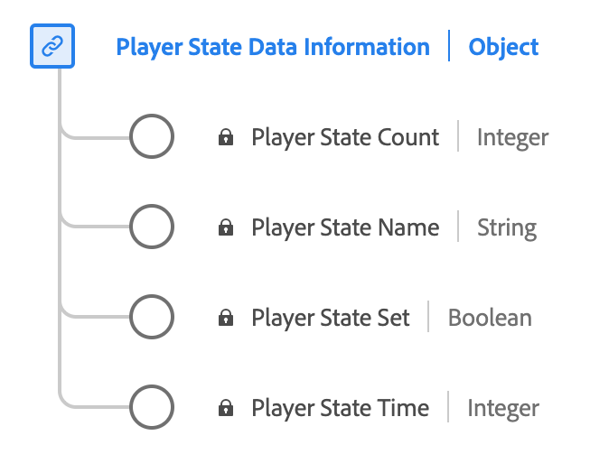

# [!UICONTROL Player State Data Reporting] data type

[!UICONTROL Player State Data Reporting] is a standard Experience Data Model (XDM) data type that describes the various states and their occurrences within a media player. Use the [!UICONTROL Player State Data Reporting] data type to capture different player states such as fullscreen, mute, closed captioning, picture-in-picture, and in-focus states. For each state, it records whether the state is set, the count of occurrences, and the total duration it remains active during the media playback.

| Display name      | Property       | Data type | Description                                  |
|-------------------|----------------|-----------|----------------------------------------------|
| [!UICONTROL Player State Name] | `name`       | string    | The name of the player state. Enumerated: "fullscreen", "mute", "closedCaptioning", "pictureInPicture", "inFocus" with respective meanings. |
| [!UICONTROL Player State Set]  | `isSet`      | boolean   | Whether or not the player state is set on that state. |
| [!UICONTROL Player State Count]| `count`      | integer   | The number of times that player state was set on the stream. |
| [!UICONTROL Player State Time] | `time`       | integer   | The total duration of that player state.      |

{style="table-layout:auto"}

For more details on the field group, refer to the [public XDM repository](https://github.com/adobe/xdm/blob/master/components/datatypes/playerstatedata.schema.json)
