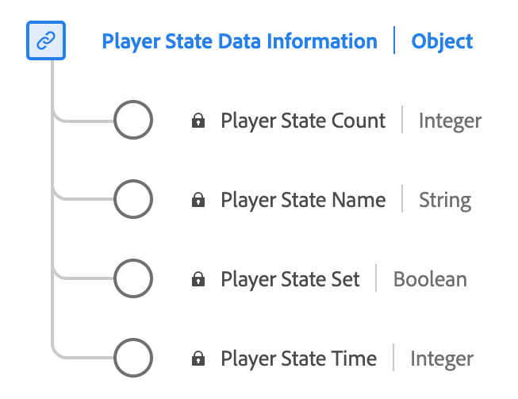

# [!UICONTROL Player State Data Reporting] data type

[!UICONTROL Player State Data Reporting] is a standard Experience Data Model (XDM) data type that describes the various states and their occurrences within a media player. Use the [!UICONTROL Player State Data Reporting] data type to capture different player states such as fullscreen, mute, closed captioning, picture-in-picture, and in-focus states. For each state, it records whether the state is set, the count of occurrences, and the total duration it remains active during the media playback.

>[!NOTE]
>
>This data type belongs to the `mediaReporting` schema — fields computed by the streaming media backend from `mediaCollection` data sent by your implementation. These are the fields that Adobe ingests into Platform datasets. See [Streaming media XDM reporting schema](https://experienceleague.adobe.com/en/docs/media-analytics/using/implementation/edge/reporting-schema) for details.

| Display name | Property | Data type | Description |
|---|---|---|---|
| [!UICONTROL Player State Name] | `name` | string | The name of the player state. Enumerated: "fullscreen" (player occupies the full screen), "mute" (audio is silenced), "closedCaptioning" (closed captions are active), "pictureInPicture" (player is in a floating overlay), "inFocus" (player has the viewer's active attention, typically because the player tab or window is in the foreground). |
| [!UICONTROL Player State Set] | `isSet` | boolean | Whether or not the player state is set on that state. |
| [!UICONTROL Player State Count] | `count` | integer | The number of times that player state was set on the stream. |
| [!UICONTROL Player State Time] | `time` | integer | The total duration of that player state, in seconds. |

See [playerstatedata.schema.json](https://github.com/adobe/xdm/blob/master/components/datatypes/playerstatedata.schema.json) in the public XDM repository for the full schema definition.
