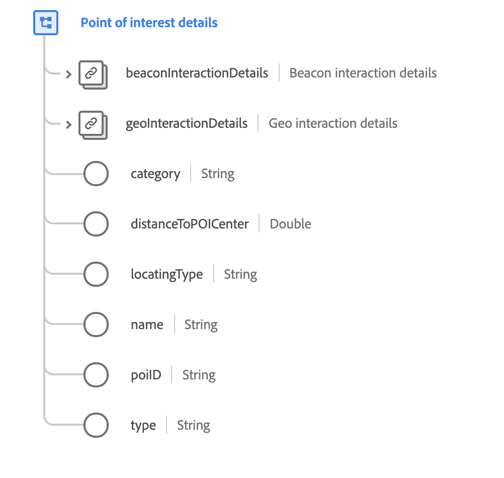

# [!UICONTROL Point of interest details] data type

[!UICONTROL Point of interest details] is a standard XDM data type that describes the geographic-related data where an event was observed.

 

| Property | Data type | Description |
| --- | --- | --- |
| `beaconInteractionDetails` | [[!UICONTROL Beacon]](./beacon.md) | Describes the beacon details active for the POI interaction. |
| `geoInteractionDetails` | [[!UICONTROL Geo interaction details]](./geo-interaction-details.md) | Describes the geo details active for the POI interaction. |
| `category` | String | A general category assigned for organizing the POIs by the administrator of POI definitions. |
| `distanceToPOICenter` | Double | The estimated distance from the POI center in meters. |
| `locatingType` | String | The mechanism used to determine location. Accepted values include: <ul><li>`beacon`</li><li>`gps`</li><li>`ip`</li><li>`ip+wifi`</li><li>`wifi-triangulation`</li></ul> |
| `name` | String | A name given to the POI. |
| `poiID` | String | A unique identifier of the POI. |
| `type` | String | The general type of the POI using a typing schema selected by the administrator of the POI definitions. |

{style="table-layout:auto"}

For more details on the data type, refer to the public XDM repository:

* [Populated example](https://github.com/adobe/xdm/blob/master/components/datatypes/poi-detail.example.1.json)
* [Full schema](https://github.com/adobe/xdm/blob/master/components/datatypes/poi-detail.schema.json)
