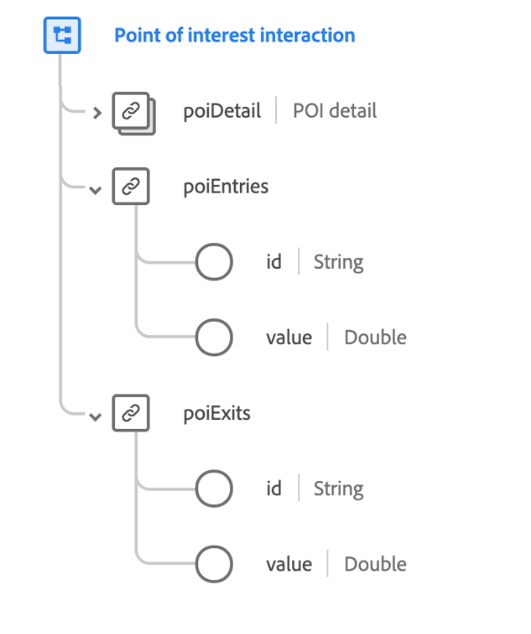

# [!UICONTROL Point of interest interaction] data type

[!UICONTROL Point of interest interaction] is a standard XDM data type that describes the wireless device that communicates identity information to mobile applications as mobile devices come within range.

 

| Property | Data type | Description |
| --- | --- | --- |
| `poiDetail` | [[!UICONTROL Point of interest details]](./poi-details.md) | Describes the details of the POI that caused the event. |
| `poiEntries` | Object | Describes the number of times a person has entered the POI. Contains two properties: <ul><li>`id`: A unique identifier for the measure.</li><li>`value`: The quantifiable value of the measure.</li></ul> |
| `poiExits` | Object | Describes the number of times a person has exited the POI. Contains two properties: <ul><li>`id`: A unique identifier for the measure.</li><li>`value`: The quantifiable value of the measure.</li></ul> |

{style="table-layout:auto"}

For more details on the data type, refer to the public XDM repository:

* [Populated example](https://github.com/adobe/xdm/blob/master/components/datatypes/deprecated/poi-interaction.example.1.json)
* [Full schema](https://github.com/adobe/xdm/blob/master/components/datatypes/deprecated/poi-interaction.schema.json)
