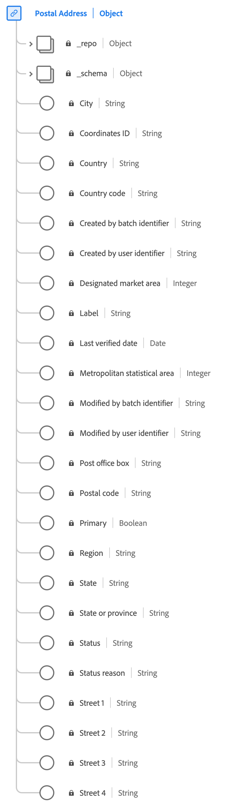

# [!UICONTROL Postal address] data type

[!UICONTROL Postal address] is a standard XDM data type that describes the details of a mailing address.

 

| Property | Description |
| --- | --- |
| `city` | The name of the city. |
| `country` | The name of the government-administered territory. This is a free-form field that can have the country name in any language. |
| `countryCode` | The two-character <a href="https://datahub.io/core/country-list">ISO 3166-1 alpha-2</a> code for the country. |
| `createdByBatchID` | The ID of the ingested batch file that created the address record. |
| `dmaID` | The Nielsen media research designated market area. |
| `label` | A free-form name for the address. |
| `lastVerifiedDate` | The date that the address was last verified as still associated to the person. |
| `modifiedByBatchID` | The ID of the ingested batch file that last modified the record. |
| `msaID` | The metropolitan statistical area in the United States where the observation occurred. |
| `postOfficeBox` | The post office box of the address. |
| `postalCode` | The postal code of the location. Postal codes are not available for all countries. In some countries, this will only contain part of the postal code. |
| `primary` | A Boolean value that indicates whether this is the individual's primary address. A profile can have only one `primary` address at a given point of time. |
| `region` | The region, county, or district portion of the address. |
| `repositoryCreatedBy` | The ID of the user who created the record. |
| `repositoryLastModifiedBy` |  The ID of the user who last modified the record. |
| `stateProvince` | The state, or province portion of the observation. The format follows the [ISO 3166-2 (country and subdivision)](https://www.unece.org/cefact/locode/subdivisions.html) standard. |
| `status` | Indicates whether the address can be currently used. |
| `statusReason` | A description of the current `status`. |
| `street1` - `street4` | These four fields are meant to contain primary street level information, apartment number, street number, and street name. `street2` to `street4` are optional. |

{style="table-layout:auto"}

For more details on the postal address data type, refer to the public XDM repository:

* [Populated example](https://github.com/adobe/xdm/blob/master/components/datatypes/demographic/address.example.1.json)
* [Full schema](https://github.com/adobe/xdm/blob/master/components/datatypes/demographic/address.schema.json)
