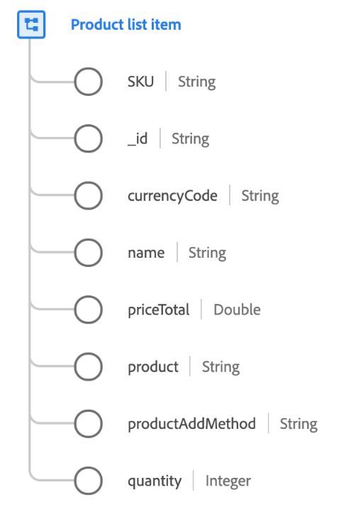

# [!UICONTROL Product list item] data type

[!UICONTROL Product list item] is a standard XDM data type that describes a product selected by a customer with specific options, pricing, and usage context for a specific point of time.

The values captured in this data type may differ from the product record. For example, the product record contains details from the product information system that are consistent for all customers, where the product list item has the actual price offered to the customer at the time of purchase, which may vary due to sales campaigns or seasonal pricing.

| Property | Data type | Description |
| --- | --- | --- |
| `SKU` | [!UICONTROL String] | Stock keeping unit (SKU), the unique identifier for a product defined by the vendor. |
| `_id` | [!UICONTROL String] | The line item identifier for this product entry. The product itself is identified through `product`. |
| `currencyCode` | [!UICONTROL String] | The [ISO 4217](https://www.iso.org/iso-4217-currency-codes.html) alphabetic currency code used for pricing the product. |
| `name` | [!UICONTROL String] | The display name for the product as presented to the user for this product view. |
| `priceTotal` | [!UICONTROL Double] | The total price for the product line item. |
| `product` | [!UICONTROL String] (URI) | The URI `$id` of the XDM schema that captures the product itself. |
| `productAddMethod` | [!UICONTROL String] | The method that was used to add a product item to the list by the visitor. |
| `quantity` | [!UICONTROL Integer] | The number of units the customer has indicated they require of the product. |

{style="table-layout:auto"}

For more details on the postal address data type, refer to the public XDM repository:

* [Populated example](https://github.com/adobe/xdm/blob/master/components/datatypes/productlistitem.example.1.json)
* [Full schema](https://github.com/adobe/xdm/blob/master/components/datatypes/productlistitem.schema.json)
