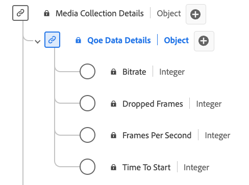

# QoE (Quality of Experience) Data Details Collection data type

[!UICONTROL QoE Data Details] Collection is a standard Experience Data Model (XDM) data type provides detailed metrics related to the quality of experience (QoE) during media playback. Use the [!UICONTROL QoE Data Details] Collection data type to capture details such as bitrate information, frame rates, buffering events, dropped frames, and so on. Media collection fields capture data and send it onto other Adobe services for further processing. This data type enables the analysis of playback quality, allowing for insights into streaming performance, user experience, and potential issues encountered during playback sessions.

+++Select to display the QoE Data Details data type.

+++

>[!NOTE]
>
>Each display name contains a link to further information on its audio and video parameters. The linked pages contain details on the video ad data collected by Adobe, implementation values, network parameters, reporting, and important considerations. 

| Display name                                                                                                                                                      | Property                 | Data type | Required | Description                                                                            |
|-------------------------------------------------------------------------------------------------------------------------------------------------------------------|--------------------------|-----------|-----------|---------------------------------------------------------------------------------------|
| [[!UICONTROL Bitrate]](https://experienceleague.adobe.com/docs/media-analytics/using/implementation/variables/quality-parameters.html#average-bitrate)            | `bitrate`                | integer   |    No     | The bitrate value (in kbps).                                                                      |
| [[!UICONTROL Dropped Frames]](https://experienceleague.adobe.com/docs/media-analytics/using/implementation/variables/quality-parameters.html#dropped-frames)      | `droppedFrames`          | integer   |    No     | The total count of frames dropped during playback.                                                 |
| [[!UICONTROL Frames Per Second]](https://experienceleague.adobe.com/docs/media-analytics/using/implementation/variables/quality-parameters.html#frames-per-second)| `framesPerSecond`        | integer   |    No     | The current stream frame-rate (in frames per second).                                              |
| [[!UICONTROL Time To Start]](https://experienceleague.adobe.com/docs/media-analytics/using/implementation/variables/quality-parameters.html#time-to-start-1)      | `timeToStart`            | integer   |    No     | Duration (in seconds) between video load and start.                                                |

{style="table-layout:auto"}
