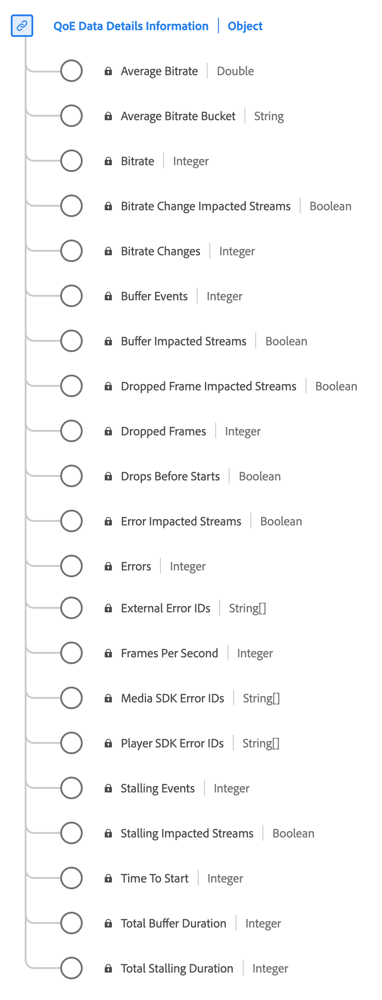

# QoE (Quality of Experience) Data Details Information data type

[!UICONTROL QoE Data Details Information] is a standard Experience Data Model (XDM) data type provides detailed metrics related to the quality of experience (QoE) during media playback. Use the [!UICONTROL QoE Data Details Information] data type to capture details such as bitrate information, frame rates, buffering events, dropped frames, and so on. This data type enables the analysis of playback quality, allowing for insights into streaming performance, user experience, and potential issues encountered during playback sessions.

+++Select to display the QoE Data Details Information data type.

+++

| Display name                           | Property                   | Data type | Description                                                                                      |
|----------------------------------------|----------------------------|-----------|--------------------------------------------------------------------------------------------------|
| [!UICONTROL Average Bitrate Bucket]    | `bitrateAverageBucket`   | string    | The average bitrate (in kbps) categorized in predefined buckets at 100kbps intervals.            |
| [!UICONTROL Bitrate]                   | `bitrate`                | integer   | The bitrate value (in kbps).                                                                      |
| [!UICONTROL Average Bitrate]           | `bitrateAverage`         | number    | The average bitrate (in kbps, integer). Computed as a weighted average of bitrate values.        |
| [!UICONTROL Bitrate Change Impacted Streams] | `hasBitrateChangeImpactedStreams` | boolean | Indicates if streams were impacted by bitrate changes during playback.                             |
| [!UICONTROL Bitrate Changes]           | `bitrateChangeCount`     | integer   | The total count of bitrate changes during playback.                                                |
| [!UICONTROL Dropped Frame Impacted Streams] | `hasDroppedFrameImpactedStreams` | boolean | Indicates if streams were impacted by dropped frames during playback.                               |
| [!UICONTROL Dropped Frames]            | `droppedFrames`          | integer   | The total count of frames dropped during playback.                                                 |
| [!UICONTROL Drops Before Starts]       | `isDroppedBeforeStart`   | boolean   | Indicates if users quit the video before its start, regardless of ads.                             |
| [!UICONTROL Frames Per Second]         | `framesPerSecond`        | integer   | The current stream frame-rate (in frames per second).                                              |
| [!UICONTROL Time To Start]             | `timeToStart`            | integer   | Duration (in seconds) between video load and start.                                                |
| [!UICONTROL Buffer Impacted Streams]   | `hasBufferImpactedStreams` | boolean | Indicates if streams were impacted by buffering during playback.                                    |
| [!UICONTROL Buffer Events]             | `bufferCount`            | integer   | The count of different buffer states during playback.                                               |
| [!UICONTROL Total Buffer Duration]     | `bufferTime`             | integer   | Total time (in seconds) spent buffering during playback.                                           |
| [!UICONTROL Error Impacted Streams]    | `hasErrorImpactedStreams` | boolean   | Indicates if streams experienced errors during playback.                                            |
| [!UICONTROL Errors]                    | `errorCount`             | integer   | The total count of errors that occurred during playback.                                            |
| [!UICONTROL Stalling Impacted Streams] | `hasStallImpactedStreams` | boolean   | Indicates if streams experienced stalling during playback.                                           |
| [!UICONTROL Stalling Events]           | `stallCount`             | integer   | The count of stalling events during playback.                                                       |
| [!UICONTROL Total Stalling Duration]   | `stallTime`              | integer   | The total time (in seconds) the playback was stalled during playback.                               |
| [!UICONTROL Player SDK Error IDs]      | `playerSdkErrors`        | array of strings | Unique error IDs generated by the player SDK during playback.                                 |
| [!UICONTROL External Error IDs]        | `externalErrors`         | array of strings | Unique error IDs from external sources, e.g., CDN errors.                                        |
| [!UICONTROL Media SDK Error IDs]       | `mediaSdkErrors`         | array of strings | Unique error IDs generated by Media SDK during playback.                                         |

{style="table-layout:auto"}

For more details on the field group, refer to the [public XDM repository](https://github.com/adobe/xdm/blob/master/components/datatypes/qoedatadetails.schema.json).

