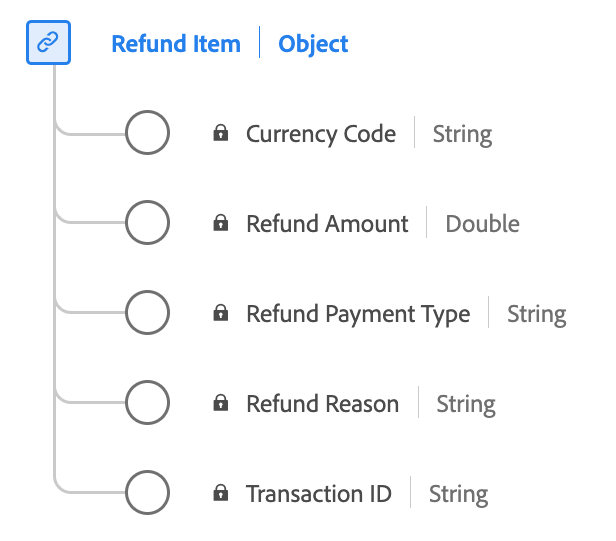

# [!UICONTROL Refund Item] data type

[!UICONTROL Refund Item] is a standard Experience Data Model (XDM) data type that describes captures information related to a refund associated with an order.

| Display name       | Property              | Data type | Description                                                                                       |
|--------------------|-----------------------|-----------|---------------------------------------------------------------------------------------------------|
| [!UICONTROL Transaction ID]     | `transactionID`     | string    | The unique transaction identifier for this refund item.                                           |
| [!UICONTROL Refund Amount]      | `refundAmount`      | number    | The value of the refund.                                                                          |
| [!UICONTROL Refund Reason]      | `refundReason`      | string    | The reason why a refund was issued.                  |
| [!UICONTROL Refund Payment Type]| `refundPaymentType` | string    | The method of payment for this order. Custom values are allowed.                        |
| [!UICONTROL Currency Code]      | `currencyCode`      | string    | The ISO 4217 currency code used for this refund item. For examples: 'USD', 'EUR'.                    |

{style="table-layout:auto"}

For more details on the data type, refer to the public XDM repository:

* [Populated example](https://github.com/adobe/xdm/blob/master/components/datatypes/refunditem.example.1.json)
* [Full schema](https://github.com/adobe/xdm/blob/master/components/datatypes/refunditem.schema.json)
