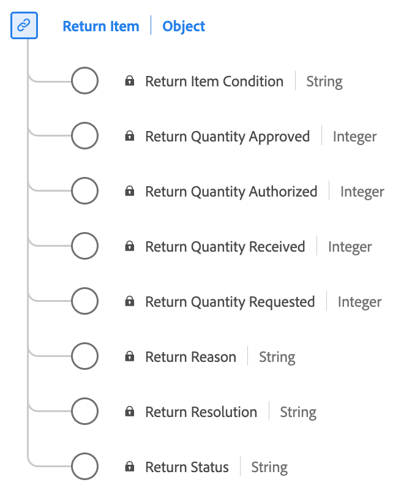

# [!UICONTROL Return Item] data type

[!UICONTROL Return Item] is a standard Experience Data Model (XDM) data type captures essential details related to the return process for a purchased item.

| Display name                | Property                     | Data type | Description                                            |
|-----------------------------|------------------------------|-----------|--------------------------------------------------------|
| [!UICONTROL Return Status]               | `returnStatus`             | string    | The status of the returned item (for example, Pending or Approved).       |
| [!UICONTROL Return Reason]               | `returnReason`             | string    | The reason why the return was requested for the item.            |
| [!UICONTROL Return Item Condition]       | `returnItemCondition`      | string    | The condition of the item for which the return is requested.|
| [!UICONTROL Return Resolution]           | `returnResolution`         | string    | The desired resolution or outcome expected from the return (for example, Refund or Exchange).|
| [!UICONTROL Return Quantity Requested]   | `returnQuantityRequested`  | integer   | The quantity of the item that the shopper requested to return.|
| [!UICONTROL Return Quantity Authorized]  | `returnQuantityAuthorized` | integer   | The quantity of the item authorized to be returned.          |
| [!UICONTROL Return Quantity Received]    | `returnQuantityReceived`   | integer   | The quantity of returned items received.                      |
| [!UICONTROL Return Quantity Approved]    | `returnQuantityApproved`   | integer   | The quantity of the item with a return fully complete and approved. |

{style="table-layout:auto"}

For more details on the data type, refer to the public XDM repository:

* [Populated example](https://github.com/adobe/xdm/blob/master/components/datatypes/returnitem.example.1.json)
* [Full schema](https://github.com/adobe/xdm/blob/master/components/datatypes/returnitem.schema.json)
