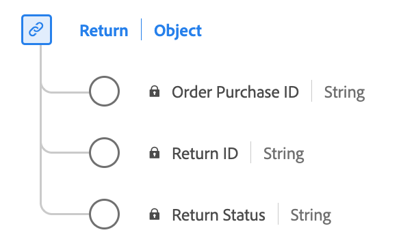

# [!UICONTROL Return] data type

[!UICONTROL Return] is a standard Experience Data Model (XDM) data type that captures the essential information related to a Return Merchandise Authorization (RMA).

| Display name                     | Property             | Data type | Description                                      |
|----------------------------------|----------------------|-----------|--------------------------------------------------|
| [!UICONTROL Return ID]           | `returnID`           | string    | The unique identifier for this RMA.               |
| [!UICONTROL Return Status]       | `returnStatus`       | string    | The current status of the RMA (for example Pending or Closed). |
| [!UICONTROL Order Purchase ID]   | `purchaseID`         | string    | The unique identifier of the order/purchase that the RMA pertains to. |

{style="table-layout:auto"}

For more details on the data type, refer to the public XDM repository:

* [Populated example](https://github.com/adobe/xdm/blob/master/components/datatypes/return.example.1.json)
* [Full schema](https://github.com/adobe/xdm/blob/master/components/datatypes/return.schema.json)
