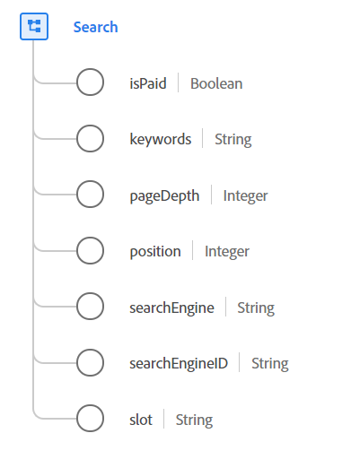

# [!UICONTROL Search] data type

[!UICONTROL Search] is a standard Experience Data Model (XDM) data type that contains information about web search activity.

 

| Property | Data type | Description |
| --- | --- | --- |
| `isPaid` | Boolean | Used to indicate if the search is paid or not. |
| `keywords` | String | The keywords for the search. |
| `pageDepth` | Integer | The page depth in the search results. |
| `position` | Integer | The position or rank of the listing in the search result page. |
| `searchEngine` | String | The search engine used by the search. |
| `searchEngineID` | String | The application-specific identifier used to identify the search engine. |
| `slot` | String | The named section of the page where the search result appeared. The value of this property must be equal to one of the known enum values you define such as `top`, `side`, or `bottom`. |

{style="table-layout:auto"}

For more details on the data type, refer to the public XDM repository:

* [Populated example](https://github.com/adobe/xdm/blob/master/components/datatypes/search.example.1.json)
* [Full schema](https://github.com/adobe/xdm/blob/master/components/datatypes/search.schema.json)
