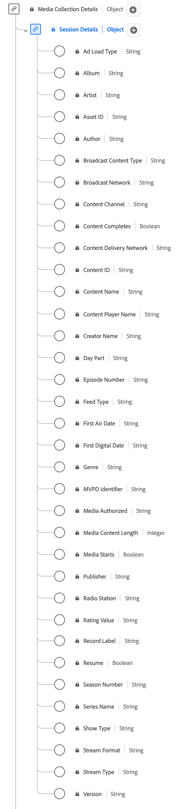

# [!UICONTROL Session Details] Collection data type

[!UICONTROL Session Details] Collection is a standard Experience Data Model (XDM) data type that tracks data related to media playback sessions. Media collection fields are used to capture data that is sent onto other Adobe services for further processing. This schema encompasses a wide range of properties that can be used to provide insights into user behavior and content consumption patterns. Use the [!UICONTROL Session Details] Collection data type to capture user engagement by logging playback events, ad interactions, progress markers, pauses, and other metrics.

+++Select to display a diagram of the Session Details Collection data type.

+++

>[!NOTE]
>
>Each display name contains a link to further information on its audio and video parameters. The linked pages contain details on the video ad data collected by Adobe, implementation values, network parameters, reporting, and important considerations. 

| Display name                                                                                                                                                             | Property         | Data type | Required | Description                                                                            |
|--------------------------------------------------------------------------------------------------------------------------------------------------------------------------|------------------|-----------|----------|---------------------------------------------------------------------------------------|
| [!UICONTROL Ad Load Type]                                                                                                                                                | `adLoad`         | String    |    No    | The type of ad loaded as defined by each customer's internal representation. | 
| [[!UICONTROL Album]](https://experienceleague.adobe.com/docs/media-analytics/using/implementation/variables/audio-video-parameters.html#album)                           | `album`          | String    |   No     | The name of the album that the music recording or video belongs to. | 
| [[!UICONTROL Artist]](https://experienceleague.adobe.com/docs/media-analytics/using/implementation/variables/audio-video-parameters.html#artist)                         | `artist`         | String    |   No     | The name of the album artist or group performing the music recording or video. | 
| [[!UICONTROL Asset ID]](https://experienceleague.adobe.com/docs/media-analytics/using/implementation/variables/audio-video-parameters.html#asset-id)                     | `assetID`        | String    |   No     | The [!UICONTROL Asset ID] is the unique identifier for the content of the media asset, such as the TV series episode identifier, movie asset identifier, or live event identifier. Typically these IDs are derived from metadata authorities such as EIDR, TMS/Gracenote, or Rovi. These identifiers can also be from other proprietary or in-house systems. |
| [[!UICONTROL Author]](https://experienceleague.adobe.com/docs/media-analytics/using/implementation/variables/audio-video-parameters.html#author)                         | `author`         | String    |    No    |The name of the media author. | 
| [[!UICONTROL Broadcast Content Type]](https://experienceleague.adobe.com/docs/media-analytics/using/implementation/variables/audio-video-parameters.html#content-type)   | `contentType`    | String    |   Yes    | The [!UICONTROL Broadcast Content Type] of the stream delivery. Available values per [!UICONTROL Stream Type] include: Audio: "song", "podcast", "audiobook", and "radio"; Video: "VoD", "Live", "Linear", "UGC", and "DVoD". Customers can provide custom values for this parameter. |
| [[!UICONTROL Broadcast Network]](https://experienceleague.adobe.com/docs/media-analytics/using/implementation/variables/audio-video-parameters.html#network)             | `network`        | String    |    No    | The network/channel name. | 
| [[!UICONTROL Content Channel]](https://experienceleague.adobe.com/docs/media-analytics/using/implementation/variables/audio-video-parameters.html#content-channel)       | `channel`        | String    |   Yes    | The [!UICONTROL Content Channel] is the distribution channel from where the content was played. | 
| [[!UICONTROL Content Completes]](https://experienceleague.adobe.com/docs/media-analytics/using/implementation/variables/audio-video-parameters.html#content-complete)    | `isCompleted`    | Boolean   |    No    | [!UICONTROL Content Completes] indicates if a timed media asset was watched to completion. This event does not necessarily mean that the viewer watched the whole video; the viewer could have skipped ahead. |
| [!UICONTROL Content Delivery Network]                                                                                                                             | `cdn`            | String    |    No    | The [!UICONTROL Content Delivery Network] of the content played. | 
| [[!UICONTROL Content ID]](https://experienceleague.adobe.com/docs/media-analytics/using/implementation/variables/audio-video-parameters.html#content-id)                 | `name`           | string    |   Yes     | The [!UICONTROL Content ID] is a unique identifier of the content. It can be used to link back to other industry or CMS IDs. |
| [[!UICONTROL Content Name]](https://experienceleague.adobe.com/docs/media-analytics/using/implementation/variables/audio-video-parameters.html#content-name-(variable))  | `friendlyName`   | String    |   No     | The [!UICONTROL Content Name] is the "friendly" (human-readable) name of the content. | 
| [[!UICONTROL Content Player Name]](https://experienceleague.adobe.com/docs/media-analytics/using/implementation/variables/audio-video-parameters.html#content-player-name)| `playerName`     | String    |   Yes    | The name of the content player. | 
| [[!UICONTROL Creator Name]](https://experienceleague.adobe.com/docs/media-analytics/using/implementation/variables/audio-video-parameters.html#originator)               | `originator`     | String    |    No    | The name of the content creator. | 
| [[!UICONTROL Day Part]](https://experienceleague.adobe.com/docs/media-analytics/using/implementation/variables/audio-video-parameters.html#day-part)                     | `dayPart`        | String    |    No    | A property that defines the time of the day when the content was broadcast or played. This could have any value set as necessary by customers | 
| [[!UICONTROL Episode Number]](https://experienceleague.adobe.com/docs/media-analytics/using/implementation/variables/audio-video-parameters.html#episode)                | `episode`        | String    |    No    | The number of the episode. | 
| [[!UICONTROL Feed Type]](https://experienceleague.adobe.com/docs/media-analytics/using/implementation/variables/audio-video-parameters.html#media-feed-type)             | `feed`           | String    |    No    | The type of feed, which can either represent actual feed-related data such as EAST HD or SD, or the source of the feed like a URL. |
| [[!UICONTROL First Air Date]](https://experienceleague.adobe.com/docs/media-analytics/using/implementation/variables/audio-video-parameters.html#first-air-date)         | `firstAirDate`   | String    |    No    | The date when the content first aired on television. Any date format is acceptable, but Adobe recommends: YYYY-MM-DD. |
| [[!UICONTROL First Digital Date]](https://experienceleague.adobe.com/docs/media-analytics/using/implementation/variables/audio-video-parameters.html#first-digital-date) | `firstDigitalDate`| String   |    No    | The date when the content first aired on any digital channel or platform. Any date format is acceptable but Adobe recommends: YYYY-MM-DD. |
| [[!UICONTROL Genre]](https://experienceleague.adobe.com/docs/media-analytics/using/implementation/variables/audio-video-parameters.html#genre)                           | `genre`          | String    |    No    | The type or grouping of content as defined by the content producer. Values should be comma-delimited in variable implementation.  |
| [[!UICONTROL Media Authorized]](https://experienceleague.adobe.com/docs/media-analytics/using/implementation/variables/audio-video-parameters.html#authorized)           | `authorized`     | String    |    No    | Confirms whether the user has been authorized via Adobe authentication. | 
| [[!UICONTROL Media Content Length]](https://experienceleague.adobe.com/docs/media-analytics/using/implementation/variables/audio-video-parameters.html#content-length-(variable))| `length`         | Integer   |   Yes    | The [!UICONTROL Media Content Length] contains the clip length/runtime - This is the maximum length (or duration) of the content being consumed (in seconds). | 
| [[!UICONTROL Media Starts]](https://experienceleague.adobe.com/docs/media-analytics/using/implementation/variables/audio-video-parameters.html#media-starts)             | `isViewed`       | Boolean   |    No    | The load event for the media. This occurs when the viewer selects the play button. This counts even if there are pre-roll ads, buffering, errors, and so on. |
| [[!UICONTROL MVPD Identifier]](https://experienceleague.adobe.com/docs/media-analytics/using/implementation/variables/audio-video-parameters.html#mvpd)                                                                                                                                      | `mvpd`           | String    |    No    | The Multi-channel Video Programming Distributor (MVPD) identifier that was provided via Adobe authentication. | 
| [[!UICONTROL Publisher]](https://experienceleague.adobe.com/docs/media-analytics/using/implementation/variables/audio-video-parameters.html#publisher)                   | `publisher`      | String    |    No    | The name of the audio content publisher. | 
| [[!UICONTROL Radio Station]](https://experienceleague.adobe.com/docs/media-analytics/using/implementation/variables/audio-video-parameters.html#station)                 | `station`        | String    |    No    | The radio station name on which the audio is played. | 
| [[!UICONTROL Rating Value]](https://experienceleague.adobe.com/docs/media-analytics/using/implementation/variables/audio-video-parameters.html#content-rating)           | `rating`         | String    |    No    | The rating as defined by TV Parental Guidelines. | 
| [[!UICONTROL Record Label]](https://experienceleague.adobe.com/docs/media-analytics/using/implementation/variables/audio-video-parameters.html#label)                    | `label`          | String    |    No    | The name of the record label. | 
| [[!UICONTROL Resume]](https://experienceleague.adobe.com/docs/media-analytics/using/implementation/variables/audio-video-parameters.html#content-resumes)                | `hasResume`      | Boolean   |    No    | Marks each playback that was resumed after more than 30 minutes of buffer, pause, or stall period. |
| [[!UICONTROL Season Number]](https://experienceleague.adobe.com/docs/media-analytics/using/implementation/variables/audio-video-parameters.html#season)                  | `season`         | String    |    No     | The [!UICONTROL Season Number] that the show belongs to. Season Series is required only if the show is part of a series. |
| [[!UICONTROL Series Name]](https://experienceleague.adobe.com/docs/media-analytics/using/implementation/variables/audio-video-parameters.html#show)                      | `show`           | String    |    No    | The Program/Series Name. The Program Name is required only if the show is part of a series. | 
| [[!UICONTROL Show Type]](https://experienceleague.adobe.com/docs/media-analytics/using/implementation/variables/audio-video-parameters.html#show-type)                   | `showType`       | String    |    No    | The type of content. For example, a trailer or a full episode. The type of content is expressed as an integer between 0 and 3. For example, "0" = Full episode; "1" = Preview/trailer; "2" = Clip; "3" = Other. | 
| [[!UICONTROL Stream Format]](https://experienceleague.adobe.com/docs/media-analytics/using/implementation/variables/audio-video-parameters.html#stream-format)           | `streamFormat`   | String    |    No    | The format of the stream (HD, SD). | 
| [[!UICONTROL Stream Type]](https://experienceleague.adobe.com/docs/media-analytics/using/implementation/variables/audio-video-parameters.html#stream-type)               | `streamType`     | String     |   No    |The type of the media stream. | 
| [[!UICONTROL Version]](https://experienceleague.adobe.com/docs/media-analytics/using/implementation/variables/audio-video-parameters.html#sdk-version)                   | `appVersion`     | String    |    No    | The SDK version used by the player. This could have any custom value that makes sense for your player. | 

{style="table-layout:auto"}

<!-- This is required for sessionStart. 
Q) How do I indicate that?
Q) Do you know where to link for:
Ad Load Type
Content Delivery Network
 -->
