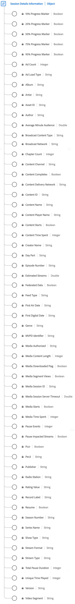

# [!UICONTROL Session Details Information] data type

[!UICONTROL Session Details Information] is a standard Experience Data Model (XDM) data type that tracks data related to media playback sessions. The schema encompasses a wide range of properties that provide insights into how media content is consumed. Use the [!UICONTROL Session Details Information] data type to capture user engagement by logging playback events, ad interactions, progress markers, pauses, and other metrics. This offers valuable insights into user behavior and content consumption patterns.

+++Select to display a diagram of the Session Details Information data type.

+++

| Display name | Property | Data type | Description |
| --- | --- | --- | --- |
| [!UICONTROL Media Session ID] | `ID` | string |  The [!UICONTROL Media Session ID] identifies an instance of a content stream unique to an individual playback. |
| [!UICONTROL Content ID] | `name` | string  | **Required** The [!UICONTROL Content ID] is a unique identifier of the content. It can be used to link back to other industry or CMS IDs. |
|  [!UICONTROL Content Name]  | `friendlyName` | String | The [!UICONTROL Content Name] is the "friendly" (human-readable) name of the content. | 
|  [!UICONTROL Media Content Length]  | `length` | Integer | **Required** The [!UICONTROL Media Content Length] contains the clip length/runtime - This is the maximum length (or duration) of the content being consumed (in seconds). | 
| [!UICONTROL Broadcast Content Type]   | `contentType` | String | **Required** The [!UICONTROL Broadcast Content Type] of the stream delivery. Available values per [!UICONTROL Stream Type] include: Audio: "song", "podcast", "audiobook", and "radio"; Video: "VoD", "Live", "Linear", "UGC", and "DVoD". Customers can provide custom values for this parameter. |
|  [!UICONTROL Content Player Name]  | `playerName` | String | **Required** The name of the content player. | 
|  [!UICONTROL Content Channel]  | `channel` | String | **Required** The [!UICONTROL Content Channel] is the distribution channel from where the content was played. | 
|  [!UICONTROL Version]  | `appVersion` | String | The SDK version used by the player. This could have any custom value that makes sense for your player. | 
| [!UICONTROL Series Name]  | `show` | String | The Program/Series Name. The Program Name is required only if the show is part of a series. | 
|  [!UICONTROL Season Number] | `season` | String  | The [!UICONTROL Season Number] that the show belongs to. Season Series is required only if the show is part of a series. |
|  [!UICONTROL Episode Number]  | `episode` | String | The number of the episode. | 
|  [!UICONTROL Asset ID] | `assetID` | String  | The [!UICONTROL Asset ID] is the unique identifier for the content of the media asset, such as the TV series episode identifier, movie asset identifier, or live event identifier. Typically these IDs are derived from metadata authorities such as EIDR, TMS/Gracenote, or Rovi. These identifiers can also be from other proprietary or in-house systems. |
|  [!UICONTROL Genre]  | `genre` | String | The type or grouping of content as defined by the content producer. Values should be comma-delimited in variable implementation.  |
|  [!UICONTROL First Air Date]  | `firstAirDate` | String | The date when the content first aired on television. Any date format is acceptable, but Adobe recommends: YYYY-MM-DD. |
| [!UICONTROL First Digital Date]  | `firstDigitalDate` | String | The date when the content first aired on any digital channel or platform. Any date format is acceptable but Adobe recommends: YYYY-MM-DD. |
| [!UICONTROL Rating Value]  | `rating` | String | The rating as defined by TV Parental Guidelines. | 
| [!UICONTROL  Creator Name]  | `originator` | String | The name of the content creator. | 
|  [!UICONTROL Broadcast Network]  | `network` | String | The network/channel name. | 
|  [!UICONTROL Show Type]  | `showType` | String | The type of content, for example, trailer or full episode. | 
| [!UICONTROL Ad Load Type]  | `adLoad` | String | The type of ad loaded as defined by each customer's internal representation. | 
|  [!UICONTROL MVPD Identifier]  | `mvpd` | String | The [!UICONTROL MVPD Identifier] that was provided via Adobe authentication. | 
| [!UICONTROL Media Authorized]   | `authorized` | String | Confirms whether the user has been authorized via Adobe authentication. | 
|  [!UICONTROL Day Part]  | `dayPart` | String | A property that defines the time of the day when the content was broadcast or played. This could have any value set as necessary by customers | 
|  [!UICONTROL Feed Type]  | `feed` | String | The type of feed, which can either represent actual feed-related data such as EAST HD or SD, or the source of the feed like a URL. |
| [!UICONTROL Stream Format]  | `streamFormat` | String | The format of the stream (HD, SD). | 
|  [!UICONTROL Resume]  | `hasResume` | Boolean  | Marks each playback that was resumed after more than 30 minutes of buffer, pause, or stall period. |
|  [!UICONTROL Stream Type]  | `streamType` | String | The type of the media stream. | 
| [!UICONTROL Artist]   | `artist` | String | The name of the album artist or group performing the music recording or video. | 
|  [!UICONTROL Album]  | `album` | String | The name of the album that the music recording or video belongs to. | 
| [!UICONTROL Record Label]   | `label` | String | The name of the record label. | 
|  [!UICONTROL Author]  | `author` | String | The name of the media author. | 
| [!UICONTROL Radio Station]   | `station` | String | The radio station name on which the audio is played. | 
| [!UICONTROL Publisher]   | `publisher` | String | The name of the audio content publisher. | 
| [!UICONTROL Video Segment]   | `segment` | String | The interval that describes the part of the content that has been viewed in minutes. | 
|  [!UICONTROL Media Downloaded Flag]  | `isDownloaded` | Boolean | The stream was played locally on the device after being downloaded. | 
| [!UICONTROL Federated Data]  | `isFederated` | Boolean | [!UICONTROL Federated Data] is set to true when the hit is federated (that is, received by the customer as part of a federated data share, rather than their own implementation). |
|  [!UICONTROL Media Starts]  | `isViewed` | Boolean | The load event for the media. This occurs when the viewer selects the play button. This counts even if there are pre-roll ads, buffering, errors, and so on. |
| [!UICONTROL Content Starts] | `isPlayed` | Boolean | [!UICONTROL Content Starts] becomes true when the first frame of media is consumed. If the user drops during an ad, buffering, and so on, then there would be no [!UICONTROL Content Starts] event.  |
| [!UICONTROL Content Completes] | `isCompleted` | Boolean | [!UICONTROL Content Completes] indicates if a timed media asset was watched to completion. This event does not necessarily mean that the viewer watched the whole video; the viewer could have skipped ahead. |
| [!UICONTROL Content Time Spent] | `timePlayed` | Integer | [!UICONTROL Content Time Spent] sums the event duration (in seconds) for all events of type PLAY on the main content. | 
|  [!UICONTROL Media Time Spent]  | `totalTimePlayed` | Integer | Describes the total amount of time spent by a user on a specific timed media asset, which includes time spent watching ads. | 
|  [!UICONTROL Unique Time Played]  | `uniqueTimePlayed` | Integer | Describes the sum of the unique intervals seen by a user on a timed media asset - that is, the length playback intervals viewed multiple times are only counted once. | 
|  [!UICONTROL Average Minute Audience]  | `averageMinuteAudience`| Number | Describes the average content time spent for a specific media item - that is, the total content time spent divided by the length of all of the playback sessions. |
|  [!UICONTROL Ad Count]  | `adCount` | Integer | The number of ads started during the playback. | 
|  [!UICONTROL Chapter Count]  | `chapterCount` | Integer | The number of chapters started during the playback. | 
|  [!UICONTROL 10% Progress Marker]  | `hasProgress10` | Boolean | Indicates that the playhead passed the 10% marker of media based on stream length. The marker is only counted once, even if seeking backward. If seeking forward, markers that are skipped are not counted. |
|  [!UICONTROL 25% Progress Marker]  | `hasProgress25` | Boolean  | Indicates that the playhead passed the 25% marker of media based on stream length. Marker only counted once, even if seeking backward. If seeking forward, markers that are skipped are not counted. |
|  [!UICONTROL 50% Progress Marker]  | `hasProgress50` | Boolean  | Indicates that the playhead passed the 50% marker of media based on stream length. Marker only counted once, even if seeking backward. If seeking forward, markers that are skipped are not counted. |
|  [!UICONTROL 75% Progress Marker]  | `hasProgress75` | Boolean  | Indicates that the playhead passed the 75% marker of media based on stream length. Marker only counted once, even if seeking backward. If seeking forward, markers that are skipped are not counted. |
|  [!UICONTROL 95% Progress Marker]  | `hasProgress95` | Boolean  | Indicates that the playhead passed the 95% marker of media based on stream length. Marker only counted once, even if seeking backward. If seeking forward, markers that are skipped are not counted. |
|  [!UICONTROL Estimated Streams]  | `estimatedStreams` | Number | The estimated number of video or audio streams for each individual piece of content. | 
|  [!UICONTROL Pause Impacted Streams]  | `hasPauseImpactedStreams` | Boolean  | Indicates if one or more pauses occurred during the playback of a single media item. |
| [!UICONTROL Pause Events] | `pauseCount` | Integer | [!UICONTROL Pause Events] counts the number of pause periods that occurred during playback. | 
| [!UICONTROL Total Pause Duration] | `pauseTime` | Integer | [!UICONTROL Total Pause Duration] describes the duration in seconds in which playback was paused by the user. | 
| [!UICONTROL Media Segment Views] | `hasSegmentView` | Boolean | [!UICONTROL Media Segment Views] indicates when at least one frame, not necessarily the first, has been viewed. | 
| [!UICONTROL Media Session Server Timeout] | `secondsSinceLastCall` | Number  | The [!UICONTROL Media Session Server Timeout] indicates the amount of time, in seconds, that passed between the user's last known interaction and the moment the session was closed. |
| [!UICONTROL Content Delivery Network] | `cdn` | String | The [!UICONTROL Content Delivery Network] of the content played. | 
| [!UICONTROL Pev3] | `pev3` | String | [!UICONTROL Pev3] is the type of media stream used for reporting. | 
| [!UICONTROL Pccr] | `pccr` | Boolean | [!UICONTROL Pccr] indicates that a redirect occurred. | 

{style="table-layout:auto"}

For more details on the field group, refer to the [public XDM repository](https://github.com/adobe/xdm/blob/master/components/datatypes/sessiondetails.schema.json)
