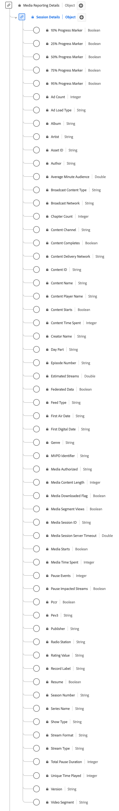

# [!UICONTROL Session Details] Reporting data type

[!UICONTROL Session Details] Reporting is a standard Experience Data Model (XDM) data type that tracks data related to media playback sessions. 
Media reporting fields are used by Adobe services to analyze the media collection fields sent by users. This data, alongside other specific user metrics, are computed and reported upon. The schema encompasses a wide range of properties that provide insights into user behavior and content consumption patterns. Use the [!UICONTROL Session Details] Reporting data type to capture user engagement by logging playback events, ad interactions, progress markers, pauses, and other metrics.

+++Select to display a diagram of the Session Details Reporting data type.

+++

>[!NOTE]
>
>Each display name contains a link to further information on its audio and video parameters. The linked pages contain details on the video ad data collected by Adobe, implementation values, network parameters, reporting, and important considerations. 

| Display name                                                                                                                                                                        | Property         | Data type |           Description                                                                            |
|-------------------------------------------------------------------------------------------------------------------------------------------------------------------------------------|------------------|-----------|--------------------------------------------------------------------------------------------------|
| [[!UICONTROL 10% Progress Marker]](https://experienceleague.adobe.com/docs/media-analytics/using/implementation/variables/audio-video-parameters.html#ten-%25-progress-marker)      | `hasProgress10`   | Boolean | Indicates that the playhead passed the 10% marker of media based on stream length. The marker is only counted once, even if seeking backward. If seeking forward, markers that are skipped are not counted. |
| [[!UICONTROL 25% Progress Marker]](https://experienceleague.adobe.com/docs/media-analytics/using/implementation/variables/audio-video-parameters.html#twenty-five-%25-progress-marker)| `hasProgress25` | Boolean  | Indicates that the playhead passed the 25% marker of media based on stream length. Marker only counted once, even if seeking backward. If seeking forward, markers that are skipped are not counted. |
| [[!UICONTROL 50% Progress Marker]](https://experienceleague.adobe.com/docs/media-analytics/using/implementation/variables/audio-video-parameters.html#50%25-progress-marker)        | `hasProgress50`   | Boolean  |  Indicates that the playhead passed the 50% marker of media based on stream length. Marker only counted once, even if seeking backward. If seeking forward, markers that are skipped are not counted. |
| [[!UICONTROL 75% Progress Marker]](https://experienceleague.adobe.com/docs/media-analytics/using/implementation/variables/audio-video-parameters.html#seventy-five-%25-progress-marker)| `hasProgress75` | Boolean  | Indicates that the playhead passed the 75% marker of media based on stream length. Marker only counted once, even if seeking backward. If seeking forward, markers that are skipped are not counted. |
| [[!UICONTROL 95% Progress Marker]](https://experienceleague.adobe.com/docs/media-analytics/using/implementation/variables/audio-video-parameters.html#ninety-five-%25-progress-marker)| `hasProgress95` | Boolean  |  Indicates that the playhead passed the 95% marker of media based on stream length. Marker only counted once, even if seeking backward. If seeking forward, markers that are skipped are not counted. |
| [[!UICONTROL Ad Count]](https://experienceleague.adobe.com/docs/media-analytics/using/implementation/variables/audio-video-parameters.html#ad-count)                                | `adCount`          | Integer |  The number of ads started during the playback. | 
| [!UICONTROL Ad Load Type]                                                                                                                                                           | `adLoad`          | String | The type of ad loaded as defined by each customer's internal representation. | 
| [[!UICONTROL Album]](https://experienceleague.adobe.com/docs/media-analytics/using/implementation/variables/audio-video-parameters.html#album)                                      | `album`           | String |  The name of the album that the music recording or video belongs to. | 
| [[!UICONTROL Artist]](https://experienceleague.adobe.com/docs/media-analytics/using/implementation/variables/audio-video-parameters.html#artist)                                    | `artist`          | String |  The name of the album artist or group performing the music recording or video. | 
| [[!UICONTROL Asset ID]](https://experienceleague.adobe.com/docs/media-analytics/using/implementation/variables/audio-video-parameters.html#asset-id)                                | `assetID`         | String  | The [!UICONTROL Asset ID] is the unique identifier for the content of the media asset, such as the TV series episode identifier, movie asset identifier, or live event identifier. Typically these IDs are derived from metadata authorities such as EIDR, TMS/Gracenote, or Rovi. These identifiers can also be from other proprietary or in-house systems. |
| [[!UICONTROL Author]](https://experienceleague.adobe.com/docs/media-analytics/using/implementation/variables/audio-video-parameters.html#author)                                    | `author`          | String |  The name of the media author. | 
| [[!UICONTROL Average Minute Audience]](https://experienceleague.adobe.com/docs/media-analytics/using/implementation/variables/audio-video-parameters.html#average-minute-audience)  | `averageMinuteAudience`| Number  Describes the average content time spent for a specific media item - that is, the total content time spent divided by the length of all of the playback sessions. |
| [[!UICONTROL Broadcast Content Type]](https://experienceleague.adobe.com/docs/media-analytics/using/implementation/variables/audio-video-parameters.html#content-type)              | `contentType`     | String | The [!UICONTROL Broadcast Content Type] of the stream delivery. Available values per [!UICONTROL Stream Type] include: Audio: "song", "podcast", "audiobook", and "radio"; Video: "VoD", "Live", "Linear", "UGC", and "DVoD". Customers can provide custom values for this parameter. |
| [[!UICONTROL Broadcast Network]](https://experienceleague.adobe.com/docs/media-analytics/using/implementation/variables/audio-video-parameters.html#network)                        | `network`         | String | The network/channel name. | 
| [[!UICONTROL Chapter Count]](https://experienceleague.adobe.com/docs/media-analytics/using/implementation/variables/audio-video-parameters.html#chapter-count)                      | `chapterCount`   | Integer |  The number of chapters started during the playback. | 
| [[!UICONTROL Content Channel]](https://experienceleague.adobe.com/docs/media-analytics/using/implementation/variables/audio-video-parameters.html#content-channel)                 | `channel`         | String | The [!UICONTROL Content Channel] is the distribution channel from where the content was played. | 
| [[!UICONTROL Content Completes]](https://experienceleague.adobe.com/docs/media-analytics/using/implementation/variables/audio-video-parameters.html#content-complete)               | `isCompleted`     | Boolean |  [!UICONTROL Content Completes] indicates if a timed media asset was watched to completion. This event does not necessarily mean that the viewer watched the whole video; the viewer could have skipped ahead. |
| [!UICONTROL Content Delivery Network]                                                                                                                                               | `cdn`             | String |  The [!UICONTROL Content Delivery Network] of the content played. | 
| [[!UICONTROL Content ID]](https://experienceleague.adobe.com/docs/media-analytics/using/implementation/variables/audio-video-parameters.html#content-id)                            | `name`             | String |The [!UICONTROL Content ID] is a unique identifier of the content. It can be used to link back to other industry or CMS IDs. |
| [[!UICONTROL Content Name]](https://experienceleague.adobe.com/docs/media-analytics/using/implementation/variables/audio-video-parameters.html#content-name-(variable))             | `friendlyName`     | String | The [!UICONTROL Content Name] is the "friendly" (human-readable) name of the content. | 
| [[!UICONTROL Content Player Name]](https://experienceleague.adobe.com/docs/media-analytics/using/implementation/variables/audio-video-parameters.html#content-player-name)          | `playerName`       | String | The name of the content player. | 
| [[!UICONTROL Content Starts]](https://experienceleague.adobe.com/docs/media-analytics/using/implementation/variables/audio-video-parameters.html#content-starts)                    | `isPlayed`        | Boolean |  [!UICONTROL Content Starts] becomes true when the first frame of media is consumed. If the user drops during an ad, buffering, and so on, then there would be no [!UICONTROL Content Starts] event.  |
| [[!UICONTROL Content Time Spent]](https://experienceleague.adobe.com/docs/media-analytics/using/implementation/variables/audio-video-parameters.html#content-time-spent)            | `timePlayed`       | Integer |  [!UICONTROL Content Time Spent] sums the event duration (in seconds) for all events of type PLAY on the main content. | 
| [[!UICONTROL Creator Name]](https://experienceleague.adobe.com/docs/media-analytics/using/implementation/variables/audio-video-parameters.html#originator)                           | `originator`       | String |  The name of the content creator. | 
| [[!UICONTROL Day Part]](https://experienceleague.adobe.com/docs/media-analytics/using/implementation/variables/audio-video-parameters.html#day-part)                                | `dayPart`          | String |  A property that defines the time of the day when the content was broadcast or played. This could have any value set as necessary by customers | 
| [[!UICONTROL Episode Number]](https://experienceleague.adobe.com/docs/media-analytics/using/implementation/variables/audio-video-parameters.html#episode)                           | `episode`          | String |  The number of the episode. | 
| [[!UICONTROL Estimated Streams]](https://experienceleague.adobe.com/docs/media-analytics/using/implementation/variables/audio-video-parameters.html#estimated-streams)              | `estimatedStreams` | Number |  The estimated number of video or audio streams for each individual piece of content. | 
| [[!UICONTROL Federated Data]](https://experienceleague.adobe.com/docs/media-analytics/using/implementation/variables/audio-video-parameters.html#federated-data)                    | `isFederated`     | Boolean | [!UICONTROL Federated Data] is set to true when the hit is federated (that is, received by the customer as part of a federated data share, rather than their own implementation). |
| [[!UICONTROL Feed Type]](https://experienceleague.adobe.com/docs/media-analytics/using/implementation/variables/audio-video-parameters.html#media-feed-type)                        | `feed`            | String |  The type of feed, which can either represent actual feed-related data such as EAST HD or SD, or the source of the feed like a URL. |
| [[!UICONTROL First Air Date]](https://experienceleague.adobe.com/docs/media-analytics/using/implementation/variables/audio-video-parameters.html#first-air-date)                    | `firstAirDate`     | String |  The date when the content first aired on television. Any date format is acceptable, but Adobe recommends: YYYY-MM-DD. |
| [[!UICONTROL First Digital Date]](https://experienceleague.adobe.com/docs/media-analytics/using/implementation/variables/audio-video-parameters.html#first-digital-date)            | `firstDigitalDate` | String | The date when the content first aired on any digital channel or platform. Any date format is acceptable but Adobe recommends: YYYY-MM-DD. |
| [[!UICONTROL Genre]](https://experienceleague.adobe.com/docs/media-analytics/using/implementation/variables/audio-video-parameters.html#genre)                                      | `genre`            | String |   The type or grouping of content as defined by the content producer. Values should be comma-delimited in variable implementation.  |
| [[!UICONTROL Media Authorized]](https://experienceleague.adobe.com/docs/media-analytics/using/implementation/variables/audio-video-parameters.html#authorized)                      | `authorized`        | String | Confirms whether the user has been authorized via Adobe authentication. | 
| [[!UICONTROL Media Content Length]](https://experienceleague.adobe.com/docs/media-analytics/using/implementation/variables/audio-video-parameters.html#content-length-(variable))   | `length`            | Integer |    YES   | The [!UICONTROL Media Content Length] contains the clip length/runtime - This is the maximum length (or duration) of the content being consumed (in seconds). | 
| [[!UICONTROL Media Downloaded Flag]](https://experienceleague.adobe.com/docs/media-analytics/using/implementation/variables/audio-video-parameters.html#media-downloaded-flag)      | `isDownloaded`      | Boolean |  The stream was played locally on the device after being downloaded. | 
| [[!UICONTROL Media Segment Views]](https://experienceleague.adobe.com/docs/media-analytics/using/implementation/variables/audio-video-parameters.html#content-segment-views)        | `hasSegmentView`     | Boolean | [!UICONTROL Media Segment Views] indicates when at least one frame, not necessarily the first, has been viewed. | 
| [[!UICONTROL Media Session ID]](https://experienceleague.adobe.com/docs/media-analytics/using/implementation/variables/audio-video-parameters.html#media-session-id)                | `ID`                 | String | The [!UICONTROL Media Session ID] identifies an instance of a content stream unique to an individual playback. <em>Note:<em>`sessionId` is sent on all events, except for `sessionStart` and for all downloaded events.  |
| [[!UICONTROL Media Session Server Timeout]](https://experienceleague.adobe.com/docs/media-analytics/using/implementation/variables/audio-video-parameters.html#seconds-since-last-call) | `secondsSinceLastCall` | Number  The [!UICONTROL Media Session Server Timeout] indicates the amount of time, in seconds, that passed between the user's last known interaction and the moment the session was closed. |
| [[!UICONTROL Media Starts]](https://experienceleague.adobe.com/docs/media-analytics/using/implementation/variables/audio-video-parameters.html#media-starts)                        | `isViewed`            | Boolean |  The load event for the media. This occurs when the viewer selects the play button. This counts even if there are pre-roll ads, buffering, errors, and so on. |
| [[!UICONTROL Media Time Spent]](https://experienceleague.adobe.com/docs/media-analytics/using/implementation/variables/audio-video-parameters.html#media-time-spent)                | `totalTimePlayed`    | Integer | Describes the total amount of time spent by a user on a specific timed media asset, which includes time spent watching ads. | 
| [[!UICONTROL MVPD Identifier]](https://experienceleague.adobe.com/docs/media-analytics/using/implementation/variables/audio-video-parameters.html#mvpd)                             | `mvpd`               | String | The [!UICONTROL MVPD Identifier] that was provided via Adobe authentication. | 
| [[!UICONTROL Pause Events]](https://experienceleague.adobe.com/docs/media-analytics/using/implementation/variables/audio-video-parameters.html#pause-events)                        | `pauseCount`         | Integer | [!UICONTROL Pause Events] counts the number of pause periods that occurred during playback. | 
| [[!UICONTROL Pause Impacted Streams]](https://experienceleague.adobe.com/docs/media-analytics/using/implementation/variables/audio-video-parameters.html#paused-impacted-streams)   | `hasPauseImpactedStreams` | Boolean Indicates if one or more pauses occurred during the playback of a single media item. |
| [!UICONTROL Pccr]                                                                                                                                                                   | `pccr`              | Boolean | [!UICONTROL Pccr] indicates that a redirect occurred. | 
| [!UICONTROL Pev3]                                                                                                                                                                   | `pev3`              | String |  [!UICONTROL Pev3] is the type of media stream used for reporting. | 
| [[!UICONTROL Publisher]](https://experienceleague.adobe.com/docs/media-analytics/using/implementation/variables/audio-video-parameters.html#publisher)                              | `publisher`         | String |  The name of the audio content publisher. | 
| [[!UICONTROL Radio Station]](https://experienceleague.adobe.com/docs/media-analytics/using/implementation/variables/audio-video-parameters.html#station)                            | `station`            | String | The radio station name on which the audio is played. | 
| [[!UICONTROL Rating Value]](https://experienceleague.adobe.com/docs/media-analytics/using/implementation/variables/audio-video-parameters.html#content-rating)                      | `rating`            | String |  The rating as defined by TV Parental Guidelines. | 
| [[!UICONTROL Record Label]](https://experienceleague.adobe.com/docs/media-analytics/using/implementation/variables/audio-video-parameters.html#label)                               | `label`              | String |   The name of the record label. | 
| [[!UICONTROL Resume]](https://experienceleague.adobe.com/docs/media-analytics/using/implementation/variables/audio-video-parameters.html#content-resumes)                           | `hasResume`         | Boolean  |  Marks each playback that was resumed after more than 30 minutes of buffer, pause, or stall period. |
| [[!UICONTROL Season Number]](https://experienceleague.adobe.com/docs/media-analytics/using/implementation/variables/audio-video-parameters.html#season)                             | `season`               | String  | The [!UICONTROL Season Number] that the show belongs to. Season Series is required only if the show is part of a series. |
| [[!UICONTROL Series Name]](https://experienceleague.adobe.com/docs/media-analytics/using/implementation/variables/audio-video-parameters.html#show)                                 | `show`               | String |  The Program/Series Name. The Program Name is required only if the show is part of a series. | 
| [[!UICONTROL Show Type]](https://experienceleague.adobe.com/docs/media-analytics/using/implementation/variables/audio-video-parameters.html#show-type)                              | `showType`           | String |  The type of content, for example, trailer or full episode. | 
| [[!UICONTROL Stream Format]](https://experienceleague.adobe.com/docs/media-analytics/using/implementation/variables/audio-video-parameters.html#stream-format)                      | `streamFormat`         | String | The format of the stream (HD, SD). | 
| [[!UICONTROL Stream Type]](https://experienceleague.adobe.com/docs/media-analytics/using/implementation/variables/audio-video-parameters.html#stream-type)                          | `streamType`         | String |  The type of the media stream. | 
| [[!UICONTROL Total Pause Duration]](https://experienceleague.adobe.com/docs/media-analytics/using/implementation/variables/audio-video-parameters.html#total-pause-duration)        | `pauseTime`           | Integer | [!UICONTROL Total Pause Duration] describes the duration in seconds in which playback was paused by the user. | 
| [[!UICONTROL Unique Time Played]](https://experienceleague.adobe.com/docs/media-analytics/using/implementation/variables/audio-video-parameters.html#unique-time-played)            | `uniqueTimePlayed`   | Integer |  Describes the sum of the unique intervals seen by a user on a timed media asset - that is, the length playback intervals viewed multiple times are only counted once. | 
| [[!UICONTROL Version]](https://experienceleague.adobe.com/docs/media-analytics/using/implementation/variables/audio-video-parameters.html#sdk-version)                              | `appVersion`          | String |  The SDK version used by the player. This could have any custom value that makes sense for your player. | 
| [[!UICONTROL Video Segment]](https://experienceleague.adobe.com/docs/media-analytics/using/implementation/variables/audio-video-parameters.html#content-segment)                    | `segment`           | String |  The interval that describes the part of the content that has been viewed in minutes. |

{style="table-layout:auto"}

<!-- Could not find details for :
Ad Load Type
Content Delivery Network
Pccr
Pev3
-->
