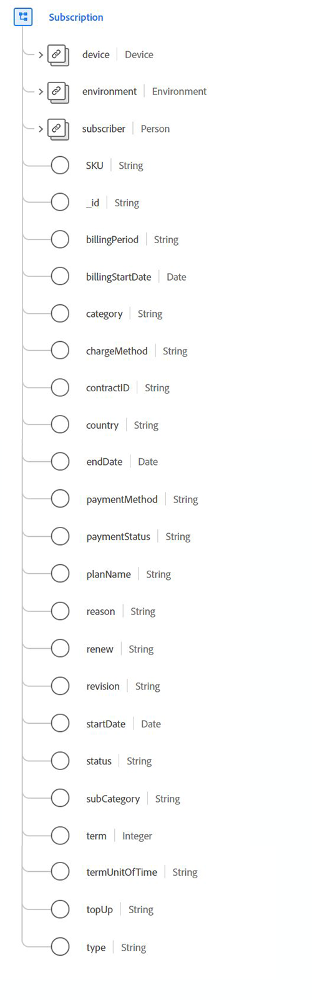

# [!UICONTROL Subscription] data type

[!UICONTROL Subscription] is a standard Experience Data Model (XDM) data type that describes licensed entitlements to software, services, or goods that are utilized based on time or usage.

 

| Property | Data type | Description |
| --- | --- | --- |
| `device` | [[!UICONTROL Device]](./device.md) | Describes details about the device thats linked to the subscription. |
| `environment` | [[!UICONTROL Environment]](./environment.md) | Contains information about the surrounding situation the event observation occurred, specifically detailing transitory information such as the network or software versions. |
| `subscriber` | [[!UICONTROL Person]](./person.md) | Describes an individual person. This can also represent a person acting in various roles, such as a customer, contact, or owner. |
| `SKU` | String | The stock-keeping unit (SKU), a unique identifier for a product. |
| `billingPeriod` | String | The duration between billings. |
| `billingStartDate` | Date | The date when the first bill is due. The date format (without time) should follow the [RFC 3339, section 5.6](https://tools.ietf.org/html/rfc3339#section-5.6) standard. |
| `category` | String | The main, top-level categorization of this type of subscription. |
| `chargeMethod` | String | The way the billing is set up to charge the customer. |
| `contractID` | String | The unique ID for the contract that governs this subscription. |
| `country` | String | The country that the subscription contractual and agreement terms are rooted in. |
| `endDate` | Date | The date the current subscription term ends. The date format (without time) should follow the [RFC 3339, section 5.6](https://tools.ietf.org/html/rfc3339#section-5.6) standard. |
| `paymentMethod` | String | The payment method for recurring payments. |
| `paymentStatus` | String | The payment standing of the account. |
| `planName` | String | The human-readable name for the subscription. |
| `reason` | String | The general intent the member has for the use of the subscription. |
| `renew` | String | The agreed way that the subscription may continue after the end date. |
| `revision` | String | The identification between subscriptions of the same name and category hierarchy. |
| `startDate` | Date | The date the subscription begins. The date format (without time) should follow the [RFC 3339, section 5.6](https://tools.ietf.org/html/rfc3339#section-5.6) standard. |
| `status` | String | The current status of the subscription. |
| `subCategory` | String | The specific sub-categorization of the subscription. |
| `term` | Integer | The numeric value of the subscription term. |
| `termUnitOfTime` | String | The unit of time for the term period. |
| `topUp` | String | Describes the agreed terms for how consumable aspects of a subscription are repurchased during a billing period. |
| `type` | String | The scope of entitlement in relation to how many people are covered by the subscription. |

{style="table-layout:auto"}

For more details on the data type, refer to the public XDM repository:

* [Populated example](https://github.com/adobe/xdm/blob/master/components/datatypes/industry-verticals/subscription.example.1.json)
* [Full schema](https://github.com/adobe/xdm/blob/master/components/datatypes/industry-verticals/subscription.schema.json)
