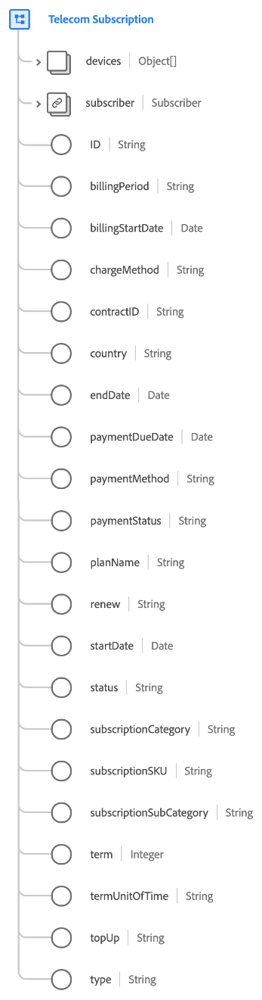
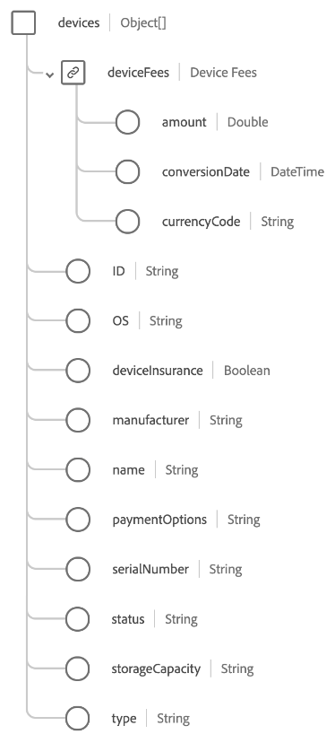

# [!UICONTROL Telecom Subscription] data type

[!UICONTROL Telecom Subscription] is a standard Experience Data Model (XDM) data type that describes details for specific telecommunication subscription types, such as internet, mobile, media, or landline.

>[!NOTE]
>
>This document describes the data type. For the field group of the same name, refer to the [[!UICONTROL Telecom Subscription] field group reference guide](../field-groups/profile/telecom-subscription.md).
>
>If you are describing a subscription type that is unrelated to the telecommunication industry, please use the generic [[!UICONTROL Subscription] data type](./subscription.md) instead.

| Property | Data type | Description |
| --- | --- | --- |
| `devices` | Array of objects | Describes a list of of devices and/or accessories associated with the plan. See the [section below](#devices) for details on the expected structure of each array item. |
| `subscriber` | [[!UICONTROL Person]](./person.md) | Describes the owner of the subscription. |
| `ID` | String | A unique identifier for the subscription instance. |
| `billingPeriod` | String | The duration between billings. |
| `billingStartDate` | Date | The date when the billing period begins. The date format (without time) should follow the [RFC 3339, section 5.6](https://tools.ietf.org/html/rfc3339#section-5.6) standard. |
| `chargeMethod` | String | The way the billing is set up to charge the customer. |
| `contractID` | String | The unique ID for the contract that governs this subscription. |
| `country` | String | The country that the subscription contractual and agreement terms are rooted in. |
| `endDate` | Date | The date the current subscription term ends. The date format (without time) should follow the [RFC 3339, section 5.6](https://tools.ietf.org/html/rfc3339#section-5.6) standard. |
| `paymentDueDate` | Date | The date when the subscription payment is due. The date format (without time) should follow the [RFC 3339, section 5.6](https://tools.ietf.org/html/rfc3339#section-5.6) standard. |
| `paymentMethod` | String | The payment method for recurring payments. |
| `paymentStatus` | String | The payment standing of the account. |
| `planName` | String | The human-readable name for the subscription. |
| `reason` | String | The general intent the member has for the use of the subscription. |
| `renew` | String | The agreed way that the subscription may continue after the end date. |
| `startDate` | Date | The date the subscription begins. The date format (without time) should follow the [RFC 3339, section 5.6](https://tools.ietf.org/html/rfc3339#section-5.6) standard. |
| `status` | String | The current status of the subscription. |
| `subscriptionCategory` | String | The main, top-level categorization of this type of subscription. |
| `subscriptionSKU` | String | The stock keeping unit (SKU) for the subscription. |
| `subscriptionSubCategory` | String | The specific sub-categorization of the subscription. |
| `term` | Integer | The numeric value of the subscription term. |
| `termUnitOfTime` | String | The unit of time for the term period. |
| `topUp` | String | Describes the agreed terms for how consumable aspects of a subscription are repurchased during a billing period. |
| `type` | String | The scope of entitlement in relation to how many people are covered by the subscription. |

{style="table-layout:auto"}

For more details on the data type, refer to the public XDM repository:

* [Populated example](https://github.com/adobe/xdm/blob/master/components/datatypes/industry-verticals/subscription.example.1.json)
* [Full schema](https://github.com/adobe/xdm/blob/master/components/datatypes/industry-verticals/subscription.schema.json)

## `devices` {#devices}

`devices` is an array of objects, with each object describe a device or accessory associated with the subscription.

| Property | Data type | Description |
| --- | --- | --- |
| `deviceFees` | Object | An object that captures any device fees for items such as routers, modems, and receivers. Expects the following properties:<ul><li>`amount`: The monetary amount as represented by the `currencyCode`.</li><li>`conversionDate`: The date when the currency conversion was made.</li><li>`currencyCode`: The [ISO 4217](https://www.iso.org/iso-4217-currency-codes.html) currency code for the `amount`.</li></ul> |
| `ID` | String | A unique ID for the device. |
| `OS` | String | The device operating system. |
| `deviceInsurance` | String | Indicates whether a customer has opted in to insurance for this device. |
| `manufacturer` | String | The device manufacturer. |
| `name` | String | A name for the device. |
| `paymentOptions` | String | Indicates whether the device will be paid for in installments or full retail price. |
| `serialNumber` | String | The device serial number. |
| `status` | String | The device status. |
| `storageCapacity` | String | The device storage capacity.  |
| `type` | String | The device type.  |

{style="table-layout:auto"}
