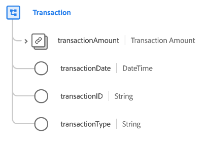

# [!UICONTROL Transaction] data type

[!UICONTROL Transaction] is a standard Experience Data Model (XDM) data type that describes the details of a monetary transaction.

| Property | Data type | Description |
| --- | --- | --- |
| `transactionAmount` | [[!UICONTROL Currency]](./currency.md) | Describes the amount of currency exchanged as part of the transaction. |
| `transactionDate` | [!UICONTROL DateTime] | A timestamp of when the transaction occurred. |
| `transactionId` | [!UICONTROL String] | A unique identifier for the transaction. |
| `transactionType` | [!UICONTROL String] | The type of transaction utilized by the visitor. |

{style="table-layout:auto"}
