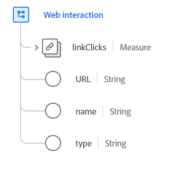

# [!UICONTROL Web interaction] data type

[!UICONTROL Web interaction] is a standard Experience Data Model (XDM) data type that describes information about interactions that happened on a web page after the initial page load was completed. It is intended for recording interactions in rich web applications that do not trigger a new page load such as single-page web apps (SPAs).

 

| Property | Data type | Description |
| --- | --- | --- |
| `linkClicks` | [[!UICONTROL Measure]](./measure.md) |  A measurement tracking the click of a web link. |
| `URL` | String | The actual link or URL used for this web interaction. |
| `name` | String | The normative name used for this web link. This is used for classification purposes. |
| `type` | String | The link type. This property must be equal to one of the following enum values: <li> `download` </li> <li> `exit` </li> <li> `other` </li>  |

{style="table-layout:auto"}

For more details on the data type, refer to the public XDM repository:

* [Populated example](https://github.com/adobe/xdm/blob/master/components/datatypes/deprecated/webinteraction.example.1.json)
* [Full schema](https://github.com/adobe/xdm/blob/master/components/datatypes/deprecated/webinteraction.schema.json)
