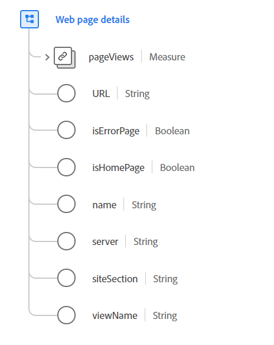

# [!UICONTROL Web page details] data type

[!UICONTROL Web page details] is a standard Experience Data Model (XDM) data type that describes details about a web page that has just been loaded and viewed, as recorded by an ExperienceEvent.

The data type is intended for full page details and initial page loads of single-page web applications (SPAs). For interactions that are happening on a loaded page that do not trigger a new page load, see the [web interaction](./web-interaction.md) data type.

 

| Property | Data type | Description |
| --- | --- | --- |
| `pageViews` | [[!UICONTROL Measure]](./measure.md) | The number of views on a webpage. |
| `URL` | String | The normative or usual URL of the web page. This may or may not be the actual URL used to reach the page. To record the URL used to reach the page use `webLink`. The URI format should follow the [RFC 3986](https://tools.ietf.org/html/rfc3986) standard. |
| `isErrorPage` | Boolean | This property uses a flag to indicate if the page is an error page or not. This flag is used to broadly categorize web interactions. The error is defined by the application, and can correspond to a page served with an HTTP error code. |
| `isHomePage` | Boolean | This property uses a flag to indicate if the page is a home page or not. This flag is used to broadly categorize web interactions. The definition of home page is determined by the application. |
| `name` | String | The normative name of the web page. This name is not necessarily the page title or directly associate with page content, but is used to organize a site's pages for classification purposes. |
| `server` | String | The normative or usual server that hosts the web page. This may or may not be the host or server that actually served the page interaction. |
| `siteSection` | String | The normative name of the site section where this web page resides. This can be used to classify or categorize the interaction. |
| `viewName` | String | The name of the view, within a page. This property is commonly used with single-page applications or pages that have tabs or controls that change a majority of the page layout. |

{style="table-layout:auto"}

For more details on the data type, refer to the public XDM repository:

* [Populated example](https://github.com/adobe/xdm/blob/master/components/datatypes/deprecated/webpagedetails.example.2.json)
* [Full schema](https://github.com/adobe/xdm/blob/master/components/datatypes/deprecated/webpagedetails.schema.json)
