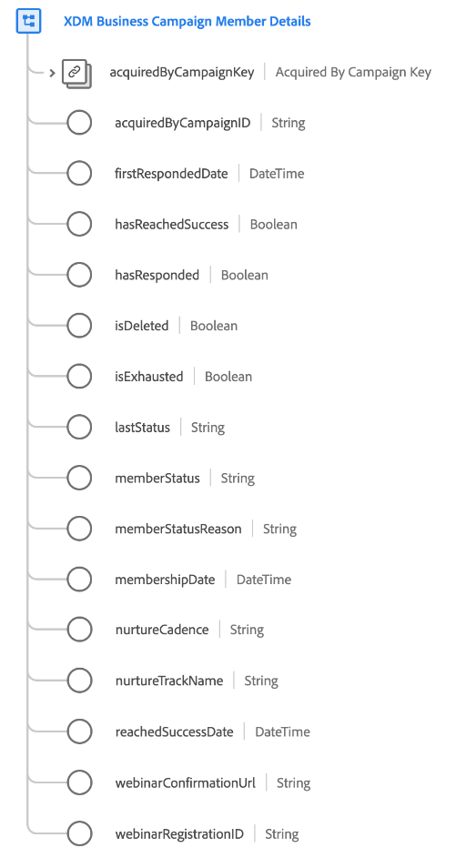

# [!UICONTROL XDM Business Campaign Member Details] schema field group

[!UICONTROL XDM Business Campaign Member Details] is a standard schema field group for the [[!UICONTROL XDM Business Campaign Members] class](../../classes/b2b/business-campaign-members.md), which captures detailed information about a business campaign.

| Property | Data type | Description |
| --- | --- | --- |
| `acquiredByCampaignKey` | [[!UICONTROL B2B Source]](../../data-types/b2b-source.md) | The composite ID of the campaign that acquired this campaign member. |
| `acquiredByCampaignID` | [!UICONTROL String] | A string identifier for the campaign that acquired this campaign member. |
| `firstRespondedDate` | [!UICONTROL DateTime] | An ISO 8601 timestamp of when the person first responded to the campaign. |
| `hasReachedSuccess` | [!UICONTROL Boolean] | Indicates whether this campaign member has resulted in a successful conversion. |
| `hasResponded` | [!UICONTROL Boolean] | Indicates whether this campaign member has responded to the campaign. |
| `isDeleted` | [!UICONTROL Boolean]  | Indicates whether this campaign member has been deleted in Marketo Engage.  When using the [Marketo source connector](../../../sources/connectors/adobe-applications/marketo/marketo.md), any records that are deleted in Marketo are automatically reflected in Real-Time Customer Profile. However, records relating to these profiles may still persist in the Data Lake. By setting `isDeleted` to `true`, you can use the field to filter out which records have been deleted from your sources when querying the Data Lake. |
| `isExhausted` | [!UICONTROL Boolean] | Indicates whether this campaign member has exhausted all campaign interactions. |
| `lastStatus` | [!UICONTROL String] | The last status for the campaign member. |
| `memberStatus` | [!UICONTROL String] | The current status for the campaign member. |
| `memberStatusReason` | [!UICONTROL String] | The reason behind the current status for the campaign member. |
| `membershipDate` | [!UICONTROL DateTime] | The reason behind the current status for the campaign member. |
| `nurtureCadence` | [!UICONTROL String] | The time cadence for campaign-related information to be presented to the campaign member. |
| `nurtureTrackName` | [!UICONTROL String] | The name of the nurture program that this campaign member is subject to. |
| `reachedSuccessDate` | [!UICONTROL DateTime] | An ISO 8601 timestamp for when a successful conversion was made for the campaign member. |
| `webinarConfirmationUrl` | [!UICONTROL String] | The webinar confirmation URL for the campaign member. |
| `webinarRegistrationID` | [!UICONTROL String] | The webinar registration ID for the campaign member. |

{style="table-layout:auto"}

For more details on the field group, refer to the public XDM repository:

* [Populated example](https://github.com/adobe/xdm/blob/master/components/fieldgroups/campaign-member/campaign-member-details.example.1.json)
* [Full schema](https://github.com/adobe/xdm/blob/master/components/fieldgroups/campaign-member/campaign-member-details.schema.json)
