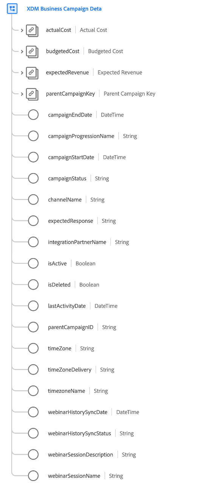

# [!UICONTROL XDM Business Campaign Details] schema field group

[!UICONTROL XDM Business Campaign Details] is a standard schema field group for the [[!UICONTROL XDM Business Campaign] class](../../classes/b2b/business-campaign.md), which captures detailed information about a business campaign.

| Property | Data type | Description |
| --- | --- | --- |
| `actualCost` | [[!UICONTROL Currency]](../../data-types/currency.md) | Represents the real cost of the business campaign. |
| `budgetedCost` | [[!UICONTROL Currency]](../../data-types/currency.md) | Represents the budgeted cost of the business campaign. |
| `expectedRevenue` | [[!UICONTROL Currency]](../../data-types/currency.md) | Represents the revenue that the business campaign is expected to generate. |
| `parentCampaignKey` | [[!UICONTROL B2B Source]](../../data-types/b2b-source.md) | The composite ID for a parent campaign, if applicable. |
| `campaignEndDate` | [!UICONTROL DateTime] | An ISO 8601 timestamp of when the campaign ended, or will end. |
| `campaignProgressionName` | [!UICONTROL String] | The campaign progression name. |
| `campaignStartDate` | [!UICONTROL DateTime] | An ISO 8601 timestamp of when the campaign started, or will start. |
| `campaignStatus` | [!UICONTROL String] | The current status of the campaign. |
| `channelName` | [!UICONTROL String] | The name of the channel associated with this campaign. |
| `expectedResponse` | [!UICONTROL String] | The expected response for the campaign. |
| `integrationPartnerName` | [!UICONTROL String] | The name of the partner that has integrated with this campaign. |
| `isActive` | [!UICONTROL Boolean] | Indicates whether this campaign is active. |
| `isDeleted` | [!UICONTROL Boolean]  | Indicates whether this campaign has been deleted in Marketo Engage.  When using the [Marketo source connector](../../../sources/connectors/adobe-applications/marketo/marketo.md), any records that are deleted in Marketo are automatically reflected in Real-Time Customer Profile. However, records relating to these profiles may still persist in the Data Lake. By setting `isDeleted` to `true`, you can use the field to filter out which records have been deleted from your sources when querying the Data Lake. |
| `lastActivityDate` | [!UICONTROL DateTime] | An ISO 8601 timestamp of the last activity associated with the campaign. |
| `timeZone` | [!UICONTROL String] | The timezone that the campaign operates in. |
| `timeZoneDelivery` | [!UICONTROL String] | The delivery timezone that the campaign operates in. |
| `timeZoneName` | [!UICONTROL String] | The name of the timezone that the campaign operates in. |
| `webinarHistorySyncDate` | [!UICONTROL DateTime] | An ISO 8601 timestamp of the last webinar history sync for this campaign. |
| `webinarHistorySyncStatus` | [!UICONTROL String] | The status of the webinar history sync for this campaign. |
| `webinarSessionDescription` | [!UICONTROL String] | A description of the webinar session associated with this campaign. |
| `webinarSessionName` | [!UICONTROL String] | A name of the webinar session associated with this campaign. |

{style="table-layout:auto"}

For more details on the field group, refer to the [public XDM repository](https://github.com/adobe/xdm/blob/master/components/fieldgroups/campaign/campaign-details.schema.json).
