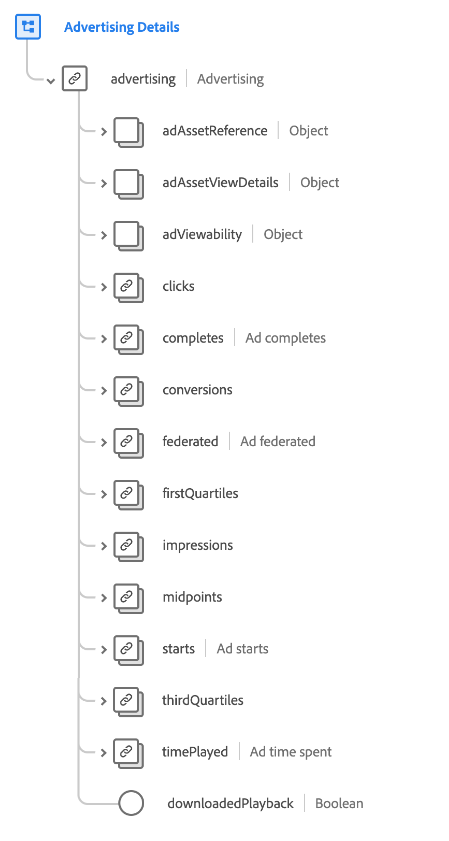
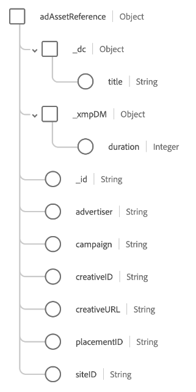
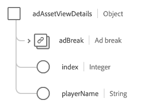
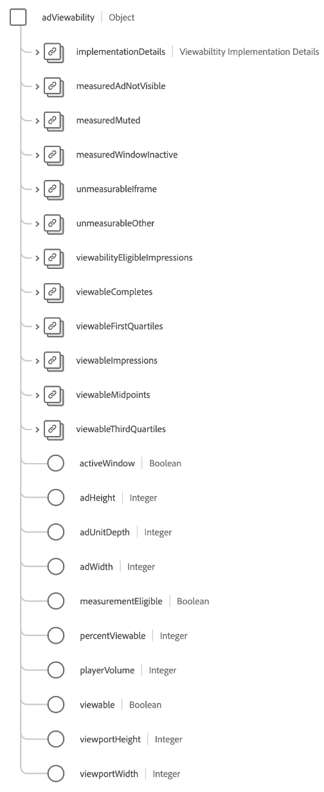

# [!UICONTROL Advertising Details] schema field group

[!UICONTROL Advertising Details] is a standard schema field group for the [[!DNL XDM ExperienceEvent] class](../../classes/experienceevent.md). The field group provides a single `advertising` object to a schema, which captures information related to advertising impressions, clickthroughs, and attribution.

| Property | Data type | Description |
| --- | --- | --- |
| `adAssetReference` | Object | Captures asset information about the ad. See the [subsection below](#adAssetReference) for more information on this object's structure. |
| `adAssetViewDetails` | Object | Captures view details for the ad playback. See the [subsection below](#adAssetViewDetails) for more information on this object's structure. |
| `adViewability` | Object | Captures the number of impressions that are seen by end-users such as player volume, library version, window status, and ad viewport dimensions. See the [subsection below](#adViewability) for more information on this object's structure. |
| `clicks` | [[!UICONTROL Measure]](../../data-types/measure.md) | The number of click actions on the advertisement. |
| `completes` | [[!UICONTROL Measure]](../../data-types/measure.md) | The number of times a timed media asset was watched to completion. This does not necessarily mean the end-user watched the whole video as they may have skipped ahead. |
| `conversions` | [[!UICONTROL Measure]](../../data-types/measure.md) | The number of times a pre-defined action (or actions) triggered an event for performance evaluation. |
| `federated` | [[!UICONTROL Measure]](../../data-types/measure.md) | Indicates if an experience event was created through data federation such as data sharing between customers. |
| `firstQuartiles` | [[!UICONTROL Measure]](../../data-types/measure.md) | The number of times a digital video ad that has played through 25% of its duration at normal speed. |
| `impressions` | [[!UICONTROL Measure]](../../data-types/measure.md) | The number of ad impressions sent to an end-user with the potential of being viewed. |
| `midpoints` | [[!UICONTROL Measure]](../../data-types/measure.md) | The number of times a digital video ad that has played through 50% of its duration at normal speed. |
| `starts` | [[!UICONTROL Measure]](../../data-types/measure.md) | The number of times a digital video ad has started playing. |
| `thirdQuartiles` | [[!UICONTROL Measure]](../../data-types/measure.md) | The number of times a digital video ad that has played through 75% of its duration at normal speed. |
| `timePlayed` | [[!UICONTROL Measure]](../../data-types/measure.md) | The amount of time spent by an end-user on a specific timed media asset. |
| `downloadedPlayback` | Boolean | When set to `true`, indicates that the hit is generated due to playing a downloaded ad session. |

{style="table-layout:auto"}

## `adAssetReference` {#adAssetReference}

The `adAssetReference` object captures asset information about the ad.

| Property | Data type | Description |
| --- | --- | --- |
| `_dc.title` | String | The friendly and human-readable name of the ad asset. |
| `_xmpDM.duration` | Integer | The length or duration of the asset in seconds. |
| `_id` | String | A unique identifier of the ad asset, following the [Ad-ID standard](https://datatracker.ietf.org/doc/html/rfc8107). |
| `advertiser` | String | The company or brand whose product is featured in the ad. |
| `campaign` | String | The ID of the ad campaign. |
| `creativeID` | String | The ID of the ad creative. |
| `creativeURL` | String | The URL of the ad creative. |
| `placementID` | String | The placement ID of the ad. |
| `siteID` | String | The ID of the ad site. |

{style="table-layout:auto"}

## `adAssetViewDetails` {#adAssetViewDetails}

The `adAssetViewDetails` object captures view details for the ad playback.

| Property | Data type | Description |
| --- | --- | --- |
| `adBreak` | [[!UICONTROL Ad break]](../../data-types/ad-break.md) | Describes how a timed ad is inserted into timed media. |
| `index` | Integer | The index of the ad inside the parent ad break. For example, the first ad has index `0` and the second ad has index `1`. |
| `playerName` | String | The name of the player responsible for rendering the ad. |

{style="table-layout:auto"}

## `adViewability` {#adViewability}

The `adViewability` object captures the number of impressions that are seen by end-users such as player volume, library version, window status, and ad viewport dimensions.

| Property | Data type | Description |
| --- | --- | --- |
| `implementationDetails` | [[!UICONTROL Implementation details]](../../data-types/implementation-details.md) | The name and version of the library instrumented to measure viewability metrics. |
| `measuredAdNotVisible` | [[!UICONTROL Measure]](../../data-types/measure.md) | Indicates the ad is not visible as measured by a viewability library at impression time. |
| `measuredMuted` | [[!UICONTROL Measure]](../../data-types/measure.md) | Indicates the ad is muted as measured by a viewability library at impression time. |
| `unmeasurableIframe` | [[!UICONTROL Measure]](../../data-types/measure.md) | Indicates the ad is displayed in an inactive window as measured by a viewability library at impression time. |
| `unmeasurableOther` | [[!UICONTROL Measure]](../../data-types/measure.md) | Indicates the viewability library is not able to properly execute measurements due to the ad being displayed inside an iframe. |
| `viewabilityEligibleImpressions` | [[!UICONTROL Measure]](../../data-types/measure.md) | Impression(s) of an advertisement to an end-user with viewablility library instrumented. |
| `viewabilityCompletes` | [[!UICONTROL Measure]](../../data-types/measure.md) | Completion(s) of an advertisement to an end-user deemed viewable at completion time by a viewability library. |
| `viewableFirstQuartiles` | [[!UICONTROL Measure]](../../data-types/measure.md) | First quartile(s) of an advertisement to an end-user deemed viewable at first quartile of play by a viewability library. |
| `viewableImpressions` | [[!UICONTROL Measure]](../../data-types/measure.md) | Impressions of an advertisement to an end-user deemed viewable after two seconds of play by a viewability library. |
| `viewableMidpoints` | [[!UICONTROL Measure]](../../data-types/measure.md) | Midpoint(s) of an advertisement to an end-user deemed viewable at the midpoint of play by a viewability library. |
| `viewableThirdQuartiles` | [[!UICONTROL Measure]](../../data-types/measure.md) | Third quartile(s) of an advertisement to an end-user deemed viewable at third quartile of play by a viewability library. |
| `activeWindow` | Boolean | Indicates whether the ad was shown on the active window of the user's device. |
| `adHeight` | Integer | The number of vertical pixels of the player, measured at runtime. This can be larger than the size of the ad if the player has extra controls or thumbnails. |
| `adUnitDepth` | Integer | Publishers may embed ad units inside containers (iFrames) in order limit the ad's access solely to the code of the page. This value describes how many containers the ad unit is displayed inside of. |
| `adWidth` | Integer | The number of horizontal pixels of the player, measured at runtime. This can be larger than the size of the ad if the player has extra controls or thumbnails. |
| `measurementEligible` | Boolean | Whether or not the ad was eligible to viewability measurement. An ad is eligible if the unit has a supported creative format and tag type. |
| `percentViewable` | Integer | The percent of pixels in the ad deemed viewable at measurement time. |
| `playerVolume` | Integer | The player volume percentage as measured at runtime, where `0` is muted and `100` is maximum volume. |
| `viewable` | Boolean | Indicates whether the ad was viewable at runtime. Display ads are considered viewable when at least 50% of the ad is visible for at least one second. Video ads are considered viewable when at least 50% of the ad is visible while the video is playing for at least two consecutive seconds. |
| `viewportHeight` | Integer | The vertical size (in pixels) of the window the experience was displayed inside measured at runtime. For a web view event, this value indicates the browser viewport height. |
| `viewportWidth` | Integer | The horizontal size (in pixels) of the window the experience was displayed inside measured at runtime. For a web view event, this value indicates the browser viewport width. |

{style="table-layout:auto"}

For more details on the field group, refer to the [public XDM repository](https://github.com/adobe/xdm/blob/master/components/fieldgroups/experience-event/experienceevent-advertising.schema.json).
