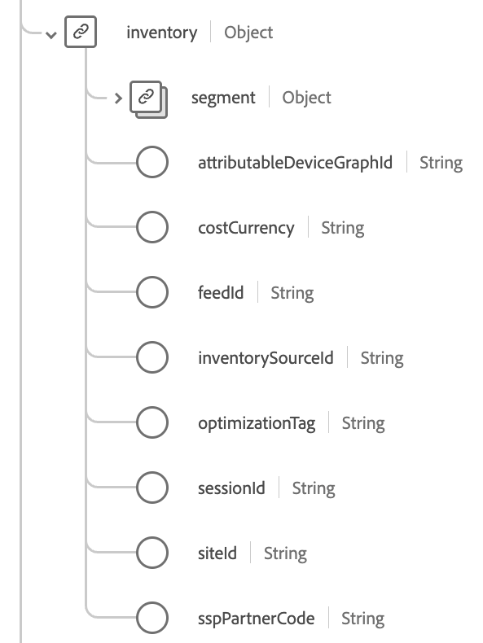

# [!UICONTROL Adobe Advertising Cloud ExperienceEvent Full Extension] schema field group

[!UICONTROL Adobe Advertising Cloud ExperienceEvent Full Extension] is a standard schema field group for the [[!DNL XDM ExperienceEvent] class](../../classes/experienceevent.md), which captures common metrics that are collected by Adobe Advertising (formerly called "[!DNL Advertising Cloud]").

This document describes the structure and use case of the [!DNL Advertising Cloud] extension field group.

>[!NOTE]
>
>You can also look up this field group [in the Experience Platform UI](../../ui/explore.md) or view the complete schema in the [public XDM repository](https://github.com/adobe/xdm/blob/master/extensions/adobe/experience/analytics/experienceevent-all.schema.json).

## Field group structure

The field group provides a single `_experience` object to a schema, which itself contains a single `adcloud` object.

![Top-level fields for the [!DNL Advertising Cloud] field group](../../images/field-groups/advertising-full-extension/full-schema.png "Top-level fields for the [!DNL Advertising Cloud] field group")

| Property | Data type | Description |
| --- | --- | --- |
| `adDeliveryDetails` | Object | Ad delivery details. See the [subsection below on the adDeliveryDetails object](#adDeliveryDetails) for more information on the contents of this object. |
| `advertisement` | Object | Digital advertisement details. See the [subsection below on the advertisement object](#advertisement) for more information on the contents of this object. |
| `campaign` | Object | Campaign hierarchy details. See the [subsection below on the campaign object](#campaign-campaign) for more information on the contents of this object. |
| `conversionDetails` | Object | Conversion details for an ad. See the [subsection below](#conversionDetails) for more information on the contents of this object. |
| `eventType` | String | The Adobe Advertising event type. |
| `fees` | Object | Advertising fee details. See the [subsection below on the fees object](#fees) for more information on the contents of this object. |
| `inventory` | Object | Inventory details. See the [subsection below](#inventory) for more information on the contents of this object. |
| `productDetails` | Object | Product ad details. See the [subsection below on the productDetails object](#productDetails) for more information on the contents of this object. |
| `stitchId` | String | ID from the Adobe Advertising ad servers to track click-through conversions on browsers that block third-party cookies. |

## `adDeliveryDetails` {#adDeliveryDetails}

Ad delivery details.

| Property | Data type | Description |
| --- | --- | --- |
| `placementWebsite` | String | Website where the advertisement was shown. |
| `siteLinkText` | String | Actual site link clicked in the advertisement. |
| `interestLocationID` | String | The location based on interest expressed in the search query. For example, when the search is for the string "hotel in goa," the ID is for Goa regardless of where the request originated. |
| `physicalLocationID` | String | The surfer browsing location. This isn't the location name (such as city or country) but a reference from the ad network for a geographic target. |

## `advertisement` {#advertisement}

Digital advertisement details.

| Property | Data type | Description |
| --- | --- | --- |
| `adId` | String | Identifier for the ad to which this event is associated. This ID is not related to the Ad-ID industry standard. |
| `runtime` | String | The runtime of the ad unit itself, not the runtime of the browser or the operating system. Values may include: `unknown` and `HTML5`. |
| `adClass` | String | The ad class of the driving event: `display`, `video`, or `social`. |
| `adUnitType` | String | Identifier for the literal piece of code driving display of the ad in a browser/device. Values can include:<ul><li>`linearVideo`: Linear video</li><li>`interactiveVideo`: Interactive video</li><li>`banner`: Banner,</li><li>`richMediaBanner`: Rich media banner,</li><li>`newsFeedVideo`: News feed video,</li><li>`newsFeedDisplay`: News feed display,</li><li>`HTML5`: HTML5,</li><li>`inPageVideo`: In page video,</li><li>`inPageDisplay`: In page display,</li><li>`facebook`: Facebook,</li><li>`twitter`: Twitter,</li><li>`linearTv`: Linear TV,</li><li>`vod`: Video on Demand</li></ul> |
| `promotedAssetId` | String | Identifier for the underlying asset being promoted in the ad with which this event is associated. |
| `creativeID` | String | Identifier for the creative with which this event is associated. |
| `keywordID` | String | Identifier for the keyword that the surfer used to search, triggering this click event. |
| `keyword` | String | Listing keyword for which the customer bid. |
| `isDynamicSearchAd` | Boolean | Indicates if the click comes from a dynamic search advertisement. |
| `audienceID` | String | Identifier for the audience segment to which the ad is targeted. |
| `adGroupID` | String | Identifier for the ad group for the displayed advertisement that triggered this click event. |
| `campaignID` | String | Identifier for the campaign for the displayed advertisement that triggered this click event. |
| `networkType` | String | The network type from which the click event came for a search advertisement or content advertisement:<ul><li>`search`: The advertisement was displayed on the Search Network.</li><li>`content`: The advertisement was displayed on the Content Network.</li></ul> |
| `matchType` | String | The match type used to match the keyword:<ul><li>`exact`: Exact match of the keyword</li><li>`broad`: Broad match of the keyword</li><li>`phrase`: Phrase match of the keyword</li></ul> |

## `campaign` {#campaign}

Ad campaign hierarchy details.

| Property | Data type | Description |
| --- | --- | --- |
| `accountId` | String | Identifier for the account. |
| `dspId` | String | Identifier for the Demand Side Platform (DSP) in which the campaign is defined. Usually, this identifier is the ID for Adobe Advertising Cloud DSP. |
| `campaignId` | String | Identifier for the campaign. |
| `placementId` | String | Identifier for the placement. |
| `packageId` | String | Identifier for the Advertising DSP package. |
| `advertiserId` | String | Identifier for the advertiser. |
| `experimentId` | String | Identifier for the experiment. |
| `sampleGroupId` | String | Identifier for the sample group. |
| `currency` | String | The ISO 4217 billing currency code for the account. Uses the regular expression pattern ^[A-Z]{3}$ (three uppercase letters). Examples: USD, EUR. |

## `conversionDetails` {#conversionDetails}

| Property | Data type | Description |
| --- | --- | --- |
| `trackingCode` | String | The conversion tracking code. For a list of possible formats, see [AMO ID Formats]https://experienceleague.corp.adobe.com/docs/advertising/integrations/customer-journey-analytics/ids.html#amo-id-formats). |
| `trackingIdentities` | String | The EF ID, or tracking identity details for an event. For a list of possible formats, see [EF ID Formats](https://experienceleague.corp.adobe.com/docs/advertising/integrations/customer-journey-analytics/ids.html#ef-id-formats). |
| `conversionProperties` | Object | A list of conversion properties. This is a map field with an array of key-pair strings (such as subscriptions=253). |

## `fees` {#fees}

Advertising fee details for Advertising DSP.

| Property | Data type | Description |
| --- | --- | --- |
| `DSPMediaFees` | Number | Media fees billable by Advertising DSP. |
| `DSPDataFees` | Number | Data fees billable by Advertising DSP. |
| `DSPOtherFees` | Number | Other fees billable by AdvertisingDSP. |
| `accountMediaFees` | Number | Media fees for the account but not billable by Advertising DSP. |
| `accountDataFees` | Number | Data fees for the account but not billable by Advertising DSP. |
| `accountOtherFees` | Number | Other fees for the account but not billable by Advertising DSP. |
| `advertiserMediaFees` | Number | Media advertiser fees charged to the advertiser from the account. |
| `advertiserDataFees` | Number | Other advertiser fees charged to the advertiser from the account. |
| `advertiserOtherFees` | Number | Other advertiser fees charged to the advertiser from the account. |
| `billableMediaNetSpend` | Number | The billable net spend for media advertising. |
| `totalMediaNetSpend` | Number | The total net spend for media advertising. |
| `billableDataNetSpend` | Number | The billable net spend for data advertising. |
| `billableOtherNetSpend` | Number | The billable net spend for other types of advertising. |
| `totalBillableNetSpend` | Number | The total billable net spend. |
| `totalNonBillableNetSpend` | Number | The total non-billable net spend. |
| `totalNetSpend` | Number | The total net spend. |

## `inventory` {#inventory}

Ad inventory details.

| Property | Data type | Description |
| --- | --- | --- |
| `sessionId` | String | Session ID associated with an experience event, used to stitch together independent events that occurred in the same session. |
| `feedID` | String | Composite ID of the publisher, ad exchange, and other features.|
| `sspPartnerCode` | String | The partner (exchange) through which Adobe Advertising Cloud receives the inventory opportunity. |
| `siteID` | String | Identifier for the web site on which the ad impression was served. |
| `costCurrency` | String | The ISO 4217 currency code used to pay a partner for an ad opportunity. Uses the regular expression pattern ^[A-Z]{3}$ (three uppercase letters). Examples: USD, EUR. |
| `inventorySourceId` | String | The ID of the Adobe Advertising Cloud inventory source on which this opportunity was delivered. |
| `segment` | Object | Details associated with user segmentation rules. Its properties include:<ul><li>`attributablePartnerId` (String): The segment provider who owns the attributableSegmentId.</li><li>`attributableSegmentId` (String): The single segment credited for user targeting among all the segments in the placement's targeting rule for the purposes of tracking costs and paying partners.</li><li>`segments` (String): The intersection of the user segments a\) to which the user belonged, and b\) that the ad was targeting. This is not the full list of segments to which the user belonged at the time of the auction.</li></ul> |
| `optimizationTag` | String | The tag related to optimization. |
| `attributableDeviceGraphId` | String | The identifier for the device graph attributed to a conversion event. |

## `productDetails` {#productDetails}

Product/shopping ad details for Adobe Advertising Search, Social, & Commerce.

| Property | Data type | Description |
| --- | --- | --- |
| `productID` | String | Identifier for the product featured in the clicked advertisement. |
| `country` | String | The country of sale for the product in the clicked ad. |
| `language` | String | The language of your product information, as indicated in client's Merchant Center data feed. |
| `partitionID` | String | Identifier for the product group to which the clicked product advertisement belongs. |
| `title` | String | Product title value shown in the advertisement. |
| `adType` | String | The ad type for the product used in Google Shopping campaigns. Values can include:<ul><li>`pla_with_pog`: When the click came from a purchase from a shopping ad</li><li>`pla`: When the click came from a shopping ad.</li><li>`pla_multichannel`: When the clicked shopping ad included options for both "online" and "local" shopping channels.</li><li>`pla_with_promotion`: When the clicked shopping ad displayed a merchant promotion.</li></ul> |

## Next steps

This document covered the structure and use case for the [!DNL Advertising Cloud] extension field group. For more details on the field group itself, refer to the [public XDM repository](https://github.com/adobe/xdm/blob/master/extensions/adobe/experience/adcloud/experienceevent-all.schema.json).

If you are using this field group to collect [!DNL Advertising] data using the Adobe Experience Platform Web SDK, see the guide on [configuring a datastream](../../../datastreams/overview.md) to learn how to map data to XDM on the server side.
