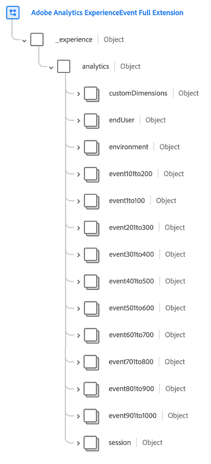
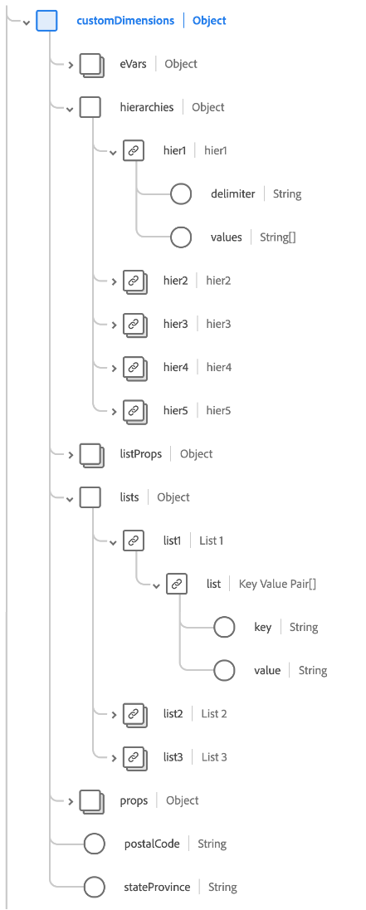
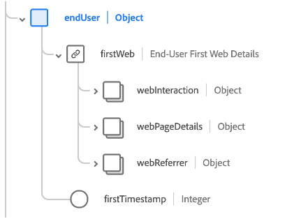
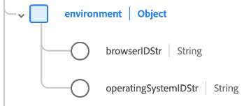
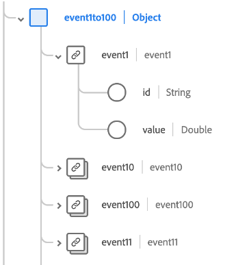
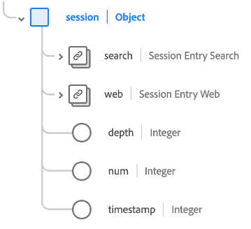

# [!UICONTROL Adobe Analytics ExperienceEvent Full Extension] schema field group

[!UICONTROL Adobe Analytics ExperienceEvent Full Extension] is a standard schema field group for the [[!DNL XDM ExperienceEvent] class](../../classes/experienceevent.md), which captures common metrics that are collected by Adobe Analytics.

This document describes the structure and use case of the Analytics extension field group.

>[!NOTE]
>
>Due to the size and number of repeated elements in this field group, many of the fields shown in this guide have been collapsed to save on space. To explore the full structure of this field group, you can [look it up in the Platform UI ](../../ui/explore.md) or view the complete schema in the [public XDM repository](https://github.com/adobe/xdm/blob/master/extensions/adobe/experience/analytics/experienceevent-all.schema.json).

## Field group structure

The field group provides a single `_experience` object to a schema, which itself contains a single `analytics` object.

| Property | Data type | Description |
| --- | --- | --- |
| `customDimensions` | Object | Captures custom dimensions that are tracked by Analytics. See the [subsection below](#custom-dimensions) for more information on the contents of this object. |
| `endUser` | Object | Captures the web interaction details for the end user that triggered the event. See the [subsection below](#end-user) for more information on the contents of this object. |
| `environment` | Object | Captures information about the browser and operating system that triggered the event. See the [subsection below](#environment) for more information on the contents of this object. |
| `event1to100`  `event101to200`  `event201to300`  `event301to400`  `event401to500`  `event501to100`  `event601to700`  `event701to800`  `event801to900`  `event901to1000` | Object | The field group provides object fields to capture up to 1000 custom events. See the [subsection below](#events) for more information on these fields. |
| `session` | Object | Captures information about the session that triggered the event. See the [subsection below](#session) for more information on the contents of this object. |

{style="table-layout:auto"}

## `customDimensions` {#custom-dimensions}

`customDimensions` captures custom [dimensions](https://experienceleague.adobe.com/docs/analytics/components/dimensions/overview.html) that are tracked by Analytics.

| Property | Data type | Description |
| --- | --- | --- |
| `eVars` | Object | An object that captures up to 250 conversion variables ([eVars](https://experienceleague.adobe.com/docs/analytics/components/dimensions/evar.html)). The properties of this object are keyed `eVar1` to `eVar250` and only accept strings for their data type. |
| `hierarchies` | Object | An object that captures up to five custom hierarchy variables ([hiers](https://experienceleague.adobe.com/docs/analytics/implementation/vars/page-vars/hier.html)). The properties of this object are keyed `hier1` to `hier5`, which are themselves objects with the following sub-properties:<ul><li>`delimiter`: The original delimiter used to generate the list provided under `values`.</li><li>`values`: A delimited list of hierarchy level names, represented as a string.</li></ul> |
| `listProps` | Object | An object that captures up to 75 [list props](https://experienceleague.adobe.com/docs/analytics/implementation/vars/page-vars/prop.html#list-props). The properties of this object are keyed `prop1` to `prop75`, which are themselves objects with the following sub-properties:<ul><li>`delimiter`: The original delimiter used to generate the list provided under `values`.</li><li>`values`: A delimited list of values for the prop, represented as a string.</li></ul> |
| `lists` | Object | An object that captures up to three [lists](https://experienceleague.adobe.com/docs/analytics/implementation/vars/page-vars/list.html). The properties of this object are keyed `list1` to `list3`. Each of these properties contains a single `list` array of [[!UICONTROL Key Value Pair]](../../data-types/key-value-pair.md) data types. |
| `props` | Object | An object that captures up to 75 [props](https://experienceleague.adobe.com/docs/analytics/implementation/vars/page-vars/prop.html). The properties of this object are keyed `prop1` to `prop75` and only accept strings for their data type. |
| `postalCode` | String | A client-supplied zip code or postal code. |
| `stateProvince` | String | A client-supplied state or province location. |

{style="table-layout:auto"}

## `endUser` {#end-user}

`endUser` captures the web interaction details for the end user that triggered the event.

| Property | Data type | Description |
| --- | --- | --- |
| `firstWeb` | [[!UICONTROL Web Information]](../../data-types/web-information.md) | The information related to web page, link, and referrer from the first Experience Event for this end user. |
| `firstTimestamp` | Integer | A Unix timestamp for the first ExperienceEvent for this end user. |

## `environment` {#environment}

`environment` captures information about the browser and operating system that triggered the event.

| Property | Data type | Description |
| --- | --- | --- |
| `browserIDStr` | String | The Adobe Analytics identifier for the browser used (otherwise known as the [browser type dimension](https://experienceleague.adobe.com/docs/analytics/components/dimensions/browser-type.html)). |
| `operatingSystemIDStr` | String | The Adobe Analytics identifier for the operating system used (otherwise known as the [operating system type dimension](https://experienceleague.adobe.com/docs/analytics/components/dimensions/operating-system-types.html)). |

## Custom event fields {#events}

The Analytics extension field group provides ten object fields that capture up to 100 [custom event metrics](https://experienceleague.adobe.com/docs/analytics/components/metrics/custom-events.html) each, for a total of 1000 for the field group.

Each top-level event object contains the individual event objects for its respective range. For example, `event101to200` contains the events keyed from `event101` to `event200`.

Each even object uses the [[!UICONTROL Measure]](../../data-types/measure.md) data type, providing a unique identifier and a quantifiable value.

## `session` {#session}

`session` captures information about the session that triggered the event.

| Property | Data type | Description |
| --- | --- | --- |
| `search` | [[!UICONTROL Search]](../../data-types/search.md) | Captures information related to web or mobile search for the session entry. |
| `web` | [[!UICONTROL Web Information]](../../data-types/web-information.md) | Captures information on link clicks, web page details, referrer information, and browser details for the session entry. |
| `depth` | Integer | The current session depth (such as the page number) for the end user. |
| `num` | Integer | The current session number for the end user. |
| `timestamp` | Integer | A Unix timestamp for the session entry. |

## Next steps

This document covered the structure and use case for the Analytics extension fieldl group. For more details on the field group itself, refer to the [public XDM repository](https://github.com/adobe/xdm/blob/master/extensions/adobe/experience/analytics/experienceevent-all.schema.json).

If you are using this field group to collect Analytics data using the Adobe Experience Platform Web SDK, see the guide on [configuring a datastream](../../../datastreams/overview.md) to learn how to map data to XDM on the server side.
