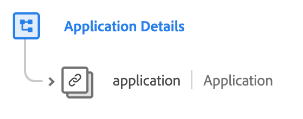

# [!UICONTROL Application Details] schema field group

[!UICONTROL Application Details] is a standard schema field group for the [[!DNL XDM ExperienceEvent] class](../../classes/experienceevent.md). The field group provides a single `application` object to a schema, which captures application-related details such as crashes, feature usage, launches, and upgrades.

| Property | Data type | Description |
| --- | --- | --- |
| `application` | [[!UICONTROL Application]](../../data-types/financial-account.md) | Captures application information related to an event, including the name of the application, app version, installs, launches, crashes, and closures. It could be either the application targeted by the event (such as the destination for a push notification being sent) or the application originating the event (such as a click or a login). |

{style="table-layout:auto"}

For more details on the field group, refer to the [public XDM repository](https://github.com/adobe/xdm/blob/master/docs/reference/fieldgroups/experience-event/experienceevent-application.schema.json).
