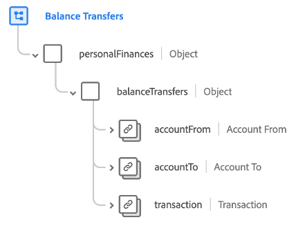

# [!UICONTROL Balance Transfers] schema field group

[!UICONTROL Balance Transfers] is a standard schema field group for the [[!DNL XDM ExperienceEvent] class](../../classes/experienceevent.md). The field group provides a single `personalFinances.balanceTransfers` object to a schema, which captures details about a financial balance transfer between accounts.

| Property | Data type | Description |
| --- | --- | --- |
| `accountFrom` | [[!UICONTROL Financial Account]](../../data-types/financial-account.md) | Describes the financial account that balance is being transferred from. |
| `accountTo` | [[!UICONTROL Financial Account]](../../data-types/financial-account.md) | Describes the financial account that balance is being transferred to. |
| `transaction` | [[!UICONTROL Transaction]](../../data-types/transaction.md) | Describes the financial transaction associated with the balance transfer. |

{style="table-layout:auto"}

For more details on the field group, refer to the [public XDM repository](https://github.com/adobe/xdm/blob/master/docs/reference/fieldgroups/experience-event/industry-verticals/experienceevent-balance-transfers.schema.json).
