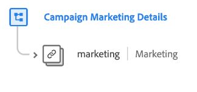

# [!UICONTROL Campaign Marketing Details] schema field group

>[!NOTE]
>
>The names of several schema field groups have changed. See the document on [field group name updates](../name-updates.md) for more information.

[!UICONTROL Campaign Marketing Details] is a standard schema field group for the [[!DNL XDM ExperienceEvent] class](../../classes/experienceevent.md), used to describe marketing campaign information such as campaign group, name, and tracking code.

| Property | Data type | Description |
| --- | --- | --- |
| `marketing` | [Marketing](../../data-types/marketing.md)  | An object that describes marketing campaign information such as campaign group, name, and tracking code. |

{style="table-layout:auto"}

For more details on the field group, refer to the public XDM repository:

* [Populated example](https://github.com/adobe/xdm/blob/master/components/fieldgroups/experience-event/experienceevent-marketing.example.1.json)
* [Full schema](https://github.com/adobe/xdm/blob/master/components/fieldgroups/experience-event/experienceevent-marketing.schema.json)
