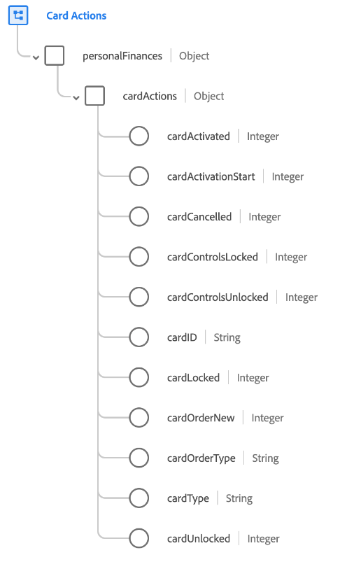

# [!UICONTROL Card Actions] schema field group

[!UICONTROL Card Actions] is a standard schema field group for the [[!DNL XDM ExperienceEvent] class](../../classes/experienceevent.md). The field group provides a single `personalFinances.cardActions` field to a schema, which captures details about a card action such as card type, activation status, and lock status.

| Property | Data type | Description |
| --- | --- | --- |
| `cardActivated` | Integer | Tracks when the card has been successfully activated. |
| `cardActivationStart` | Integer | Tracks when the card activation process has been started. |
| `cardCancelled` | Integer | Tracks when a card has been cancelled. |
| `cardControlsLocked` | Integer | Tracks when a card's controls have been locked. |
| `cardControlsUnlocked` | Integer | Tracks when a card's controls have been unlocked. |
| `cardID` | String | The identifier for the card being activated. This value might be different from the card number. |
| `cardLocked` | Integer | Tracks when a card has been locked. |
| `cardOrderNew` | Integer | Tracks when a card has been requested. |
| `cardOrderType` | String | The type of card order associated with a card order event.|
| `cardType` | String | The type of card. |
| `cardUnlocked` | Integer | Tracks when a card has been unlocked. |

{style="table-layout:auto"}

For more details on the field group, refer to the [public XDM repository](https://github.com/adobe/xdm/blob/master/docs/reference/fieldgroups/experience-event/experienceevent-card-actions.schema.json).
