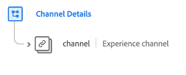

# [!UICONTROL Channel Details] schema field group

>[!NOTE]
>
>The names of several schema field groups have changed. See the document on [field group name updates](../name-updates.md) for more information.

[!UICONTROL Channel Details] is a standard schema field group for the [[!DNL XDM ExperienceEvent] class](../../classes/experienceevent.md), used to describe channel information such as ID, channel type, media type, and location type.

| Property | Data type | Description |
| --- | --- | --- |
| `channel` | [Experience channel](../../data-types/experience-channel.md)  | An object that describes product returns, warranty registration, and shopping cart/order processes. |

{style="table-layout:auto"}

For more details on the field group, refer to the public XDM repository:

* [Populated example](https://github.com/adobe/xdm/blob/master/components/fieldgroups/experience-event/experienceevent-channel.example.1.json)
* [Full schema](https://github.com/adobe/xdm/blob/master/components/fieldgroups/experience-event/experienceevent-channel.schema.json)
