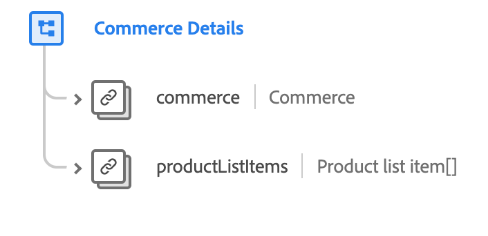

# [!UICONTROL Commerce Details] schema field group

>[!NOTE]
>
>The names of several schema field groups have changed. See the document on [field group name updates](../name-updates.md) for more information.

[!UICONTROL Commerce Details] is a standard schema field group for the [[!DNL XDM ExperienceEvent] class](../../classes/experienceevent.md), used to describe commerce data such as product information (SKU, name, quantity), and standard cart operations (order, checkout, abandon).

| Property | Data type | Description |
| --- | --- | --- |
| `commerce` | [Commerce](../../data-types/commerce.md)  | An object that describes product returns, warranty registration, and shopping cart/order processes. |
| `productListItems` | Array of [Product list items](../../data-types/product-list-item.md)  | A list of items representing the product(s) selected by a customer, with specific options and pricing at a specific point of time (which may differ from the product record). |

{style="table-layout:auto"}

For more details on the field group, refer to the public XDM repository:

* [Populated example](https://github.com/adobe/xdm/blob/master/components/fieldgroups/experience-event/experienceevent-commerce.example.1.json)
* [Full schema](https://github.com/adobe/xdm/blob/master/components/fieldgroups/experience-event/experienceevent-commerce.schema.json)
