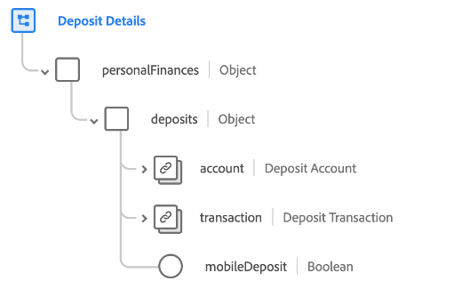

# [!UICONTROL Deposit Details] schema field group

[!UICONTROL Deposit Details] is a standard schema field group for the [[!DNL XDM ExperienceEvent] class](../../classes/experienceevent.md). The field group provides a single `personalFinances.deposits` field to a schema, which captures details about a financial deposit.

| Property | Data type | Description |
| --- | --- | --- |
| `account` | [[!UICONTROL Financial Account]](../../data-types/financial-account.md) | Describes the financial account associated with the deposit. |
| `transaction` | [[!UICONTROL Transaction]](../../data-types/transaction.md) | Describes the financial transaction associated with the deposit. |
| `mobileDeposit` | [!UICONTROL Boolean] | Indicates whether the deposit was done through a mobile platform. |

{style="table-layout:auto"}

For more details on the field group, refer to the [public XDM repository](https://github.com/adobe/xdm/blob/master/docs/reference/fieldgroups/experience-event/industry-verticals/experienceevent-deposit-details.schema.json).
