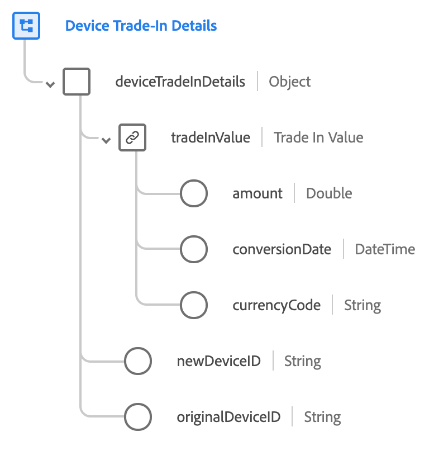

# [!UICONTROL Device Trade-In Details] schema field group

>[!NOTE]
>
>The names of several schema field groups have changed. See the document on [field group name updates](../name-updates.md) for more information.

[!UICONTROL Device Trade-In Details] is a standard schema field group for the [[!DNL XDM ExperienceEvent] class](../../classes/experienceevent.md). It provides a single field (`deviceTradeInDetails`) which describes a device trade-in transaction, including trade-in value, original device ID, and new device ID.

| Property | Data type | Description |
| --- | --- | --- |
| `tradeInValue` | [Currency](../../data-types/currency.md)  | The value of the device being traded. |
| `newDeviceID` | String | The ID of the new device being traded for. |
| `originalDeviceID` | String | The ID of the device being traded. |

{style="table-layout:auto"}

For more details on the field group, refer to the public XDM repository:

* [Populated example](https://github.com/adobe/xdm/blob/master/components/fieldgroups/experience-event/industry-verticals/experienceevent-device-trade-in-details.example.1.json)
* [Full schema](https://github.com/adobe/xdm/blob/master/components/fieldgroups/experience-event/industry-verticals/experienceevent-device-trade-in-details.schema.json)
