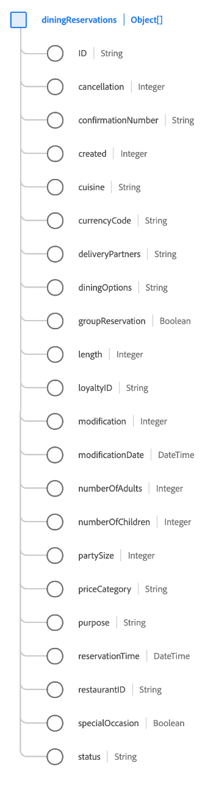

# [!UICONTROL Dining Reservation] schema field group

[!UICONTROL Dining Reservation] is a standard schema field group for the [[!DNL XDM ExperienceEvent] class](../../classes/experienceevent.md) used to capture information regarding a dining reservation.

The field group is an extension of the [!UICONTROL Reservation Details] field group, and contains all of the same fields under a single object-type field, `reservations`. In addition to these generic fields, [!UICONTROL Dining Reservation] also includes `diningReservations` array. This array of objects is used to describe one or more reservations with restaurant-specific properties.

>[!NOTE]
>
>This document covers the details of the `diningReservations` array. For information on the other fields provided under the `reservations` object, please refer to the [[!UICONTROL Reservation Details] field group reference](./reservation-details.md).

## `diningReservations`

`diningReservations` is an array of objects that represents a list of dining reservations. If a reservation event involves reservations at multiple different restaurants at different times of the day, for example, these reservations can be listed as individual objects under `diningReservations` for a single event.

The structure of each object provided under `diningReservations` is provided below.

| Property | Data type | Description |
| --- | --- | --- |
| `ID` | String | The reservation number or identifier. |
| `cancellation` | Integer | This value is captured when a reservation has been cancelled. |
| `confirmationNumber` | String | The reservation confirmation number or identifier. |
| `created` | Integer | This value is captured when a reservation has been created. |
| `cuisine` | Integer | The type of restaurant cuisine. |
| `currencyCode` | String | The ISO 4217 currency code used to make the purchase. |
| `deliveryPartners` | String | Delivery partners available from the restaurant. |
| `diningOptions` | String | Delivery and dining options available from the restaurant. |
| `groupReservation` | Boolean | Indicates whether the reservation is being made for a group. |
| `length` | Integer | The total number of days for the reservation. |
| `loyaltyID` | String | The loyalty program ID for the guest listed in the reservation. |
| `modification` | Integer | This value is captured when a reservation has been modified. |
| `modificationDate` | DateTime | The time when the reservation was last modified. |
| `numberOfAdults` | Integer | The number of adults associated with the reservation. |
| `numberOfChildren` | Integer | The number of children associated with the reservation. |
| `numberOfRooms` | Integer | The number of rooms associated with the reservation. |
| `partySize` | Integer | The number of individuals in the dining party. |
| `priceCategory` | String | The price category for the reservation being made. |
| `purpose` | String | The purpose of the reservation, typically either business or personal. |
| `reservationTime` | DateTime | The time for which the dining reservation is booked. |
| `restaurantID` | String | An identifier for the restaurant or dining location. |
| `reservationStatus` | String | The status of the reservation. |
| `specialOccasion` | Boolean | Indicates whether the reservation is being made for a special occasion. |
| `status` | Integer | The status of the dining reservation. |

{style="table-layout:auto"}

For more details on the field group, refer to the public XDM repository:

* [Populated example](https://github.com/adobe/xdm/blob/master/components/fieldgroups/experience-event/industry-verticals/experienceevent-dining-reservation.example.1.json)
* [Full schema](https://github.com/adobe/xdm/blob/master/components/fieldgroups/experience-event/industry-verticals/experienceevent-dining-reservation.schema.json)
