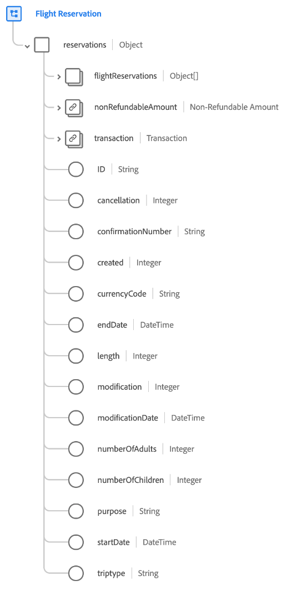
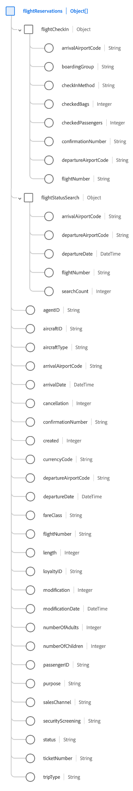

# [!UICONTROL Flight Reservation] schema field group

[!UICONTROL Flight Reservation] is a standard schema field group for the [[!DNL XDM ExperienceEvent] class](../../classes/experienceevent.md) used to capture information regarding a flight reservation.

The field group is an extension of the [!UICONTROL Reservation Details] field group, and contains all of the same fields under a single object-type field, `reservations`. In addition to these generic fields, [!UICONTROL Flight Reservation] also includes `flightReservations` array. This array of objects is used to describe one or more reservations with properties unique to air travel.

>[!NOTE]
>
>This document covers the details of the `flightReservations` array. For information on the other fields provided under the `reservations` object, please refer to the [[!UICONTROL Reservation Details] field group reference](./reservation-details.md).

## `flightReservations`

`flightReservations` is an array of objects that represents a list of flight reservations. If a reservation event involves reservations for multiple connecting flights on a trip, for example, these reservations can be listed as individual objects under `flightReservations` for a single event.

The structure of each object provided under `flightReservations` is provided below.

| Property | Data type | Description |
| --- | --- | --- |
| `flightCheckIn` | Object | Captures details about the flight check-in. The object includes the following properties:<ul><li>`arrivalAirportCode`: (String) The airport code of the arrival city.</li><li>`boardingGroup`: (String) The airline-specific indicator of boarding order.</li><li>`checkInMethod`: (String) The method used the check in, such as counter, online, kiosk, or self-service.</li><li>`checkedBags`: (Integer) The number of bags checked for the flight.</li><li>`checkedPassengers`: (Integer) The number of passengers checked in for the flight, if multiple passengers exist for the same reservation number.</li><li>`confirmationNumber`: (String) The reservation confirmation number or identifier.</li><li>`departureAirportCode`: (String) The airport code of the departure city.</li><li>`flightNumber`: (String) The flight number for the flight being reserved.</li></ul> |
| `flightStatusSearch` | Object | Captures the details returned when the flight's status is searched. The object includes the following properties:<ul><li>`arrivalAirportCode`: (String) The airport code of the arrival city.</li><li>`boardingGroup`: (String) The airline-specific indicator of boarding order.</li><li>`departureAirportCode`: (String) The airport code of the departure city.</li><li>`departureDate`: (DateTime) The departure date of the flight being reserved.</li><li>`flightNumber`: (String) The flight number for the flight being reserved.</li><li>`searchCount`: (Integer) The number of times the reserved flight's status has been searched for.</li></ul> |
| `agentID` | String | The agent or booker responsible for booking the reservation, if applicable. |
| `aircraftID` | String | An identifier for the aircraft. |
| `aircraftType` | String | The type of aircraft. |
| `arrivalAirportCode` | String | The airport code of the arrival city. |
| `arrivalDate` | DateTime | The arrival date of the flight being reserved. |
| `cancellation` | Integer | This value is captured when a reservation has been cancelled. |
| `confirmationNumber` | String | The reservation confirmation number or identifier. |
| `created` | String | This value is captured when a reservation has been created. |
| `currencyCode` | String | The ISO 4217 currency code used to make the purchase. |
| `departureAirportCode` | String | The airport code of the departure city. |
| `departureDate` | DateTime | The departure date of the flight being reserved. |
| `fareClass` | String | The fare class of the flight being reserved. |
| `flightNumber` | String | The flight number of the flight being reserved. |
| `length` | Integer | The total number of days for the reservation. |
| `loyaltyID` | String | The loyalty or rewards program ID for the passenger listed in the reservation. |
| `modification` | Integer | This value is captured when a reservation has been modified. |
| `modificationDate` | DateTime | The time when the reservation was last modified. |
| `numberOfAdults` | Integer | The number of adults associated with the reservation. |
| `numberOfChildren` | Integer | The number of children associated with the reservation. |
| `passengerID` | String | Passenger info associated with the reservation. |
| `purpose` | String | The purpose of the reservation, typically either business or personal. |
| `salesChannel` | String | The sales channel from which the reservation was booked. |
| `securityScreening` | String | The type of security screening the passenger is subject to. |
| `status` | String | The status of the flight reservation. |
| `ticketNumber` | String | The reservation number or identifier. |
| `tripType` | String | Indicates if the reservation is for a one-way trip, a round trip, or a multi-city trip. |

{style="table-layout:auto"}

For more details on the field group, refer to the public XDM repository:

* [Populated example](https://github.com/adobe/xdm/blob/master/components/fieldgroups/experience-event/industry-verticals/experienceevent-flight-reservation.example.1.json)
* [Full schema](https://github.com/adobe/xdm/blob/master/components/fieldgroups/experience-event/industry-verticals/experienceevent-flight-reservation.schema.json)
