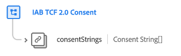

# [!UICONTROL IAB TCF 2.0 Consent] field group for event schemas

>[!IMPORTANT]
>
>This document covers the [!UICONTROL IAB TCF 2.0 Consent] schema field group for the XDM ExperienceEvent class. This field group should only be used if you intend to track consent change events over time.
>
>Note that consent values recorded in event data are not honored in automatic enforcement workflows. In order for automatic enforcement to take place, consent values must be ingested into the XDM Individual Profile class and enabled for Real-Time Customer Profile.
>
>For the field group intended for the XDM Individual Profile class, refer to the following [document](../profile/iab.md) instead.

[!UICONTROL IAB TCF 2.0 Consent] is a standard schema field group for the [[!DNL XDM ExperienceEvent] class](../../classes/experienceevent.md) used to capture a timestamped series IAB consent strings, in order to track consent-change patterns over time.

| Property | Data type | Description |
| --- | --- | --- |
| `consentStrings` | Array of [Consent Strings](../../data-types/consent-string.md)  | An array of consent string values associated with the event. |

{style="table-layout:auto"}

See the guide on [IAB TCF 2.0 support in Platform](../../../landing/governance-privacy-security/consent/iab/overview.md) for more information on the use case of this field group. For more details on the field group itself, refer to the public XDM repository:

* [Populated example](https://github.com/adobe/xdm/blob/master/components/fieldgroups/experience-event/experienceevent-privacy.example.1.json)
* [Full schema](https://github.com/adobe/xdm/blob/master/components/fieldgroups/experience-event/experienceevent-privacy.schema.json)
