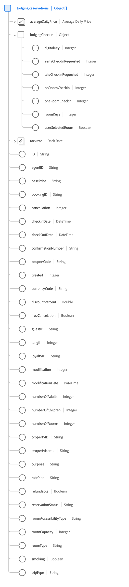

# [!UICONTROL Lodging Reservation] schema field group

[!UICONTROL Lodging Reservation] is a standard schema field group for the [[!DNL XDM ExperienceEvent] class](../../classes/experienceevent.md) used to capture information regarding a lodging reservation.

The field group is an extension of the [!UICONTROL Reservation Details] field group, and contains all of the same fields under a single object-type field, `reservations`. In addition to these generic fields, [!UICONTROL Lodging Reservation] also includes `lodgingReservations` array. This array of objects is used to describe one or more reservations with properties unique to lodging.

>[!NOTE]
>
>This document covers the details of the `lodgingReservations` array. For information on the other fields provided under the `reservations` object, please refer to the [[!UICONTROL Reservation Details] field group reference](./reservation-details.md).

## `lodgingReservations`

`lodgingReservations` is an array of objects that represents a list of lodging reservations. If a reservation event involves reservations at multiple different hotels along the route of a trip, for example, these reservations can be listed as individual objects under `lodgingReservations` for a single event.

The structure of each object provided under `lodgingReservations` is provided below.

| Property | Data type | Description |
| --- | --- | --- |
| `averageDailyPrice` | [[!UICONTROL Currency]](../../data-types/currency.md)  | The average daily price of the hotel room. |
| `lodgingCheckIn` | Object | An object that describes lodging check-in details. Includes the following values:<ul><li>`digitalKey`: (Integer) Indicates when a guest selects the use of a digital key upon checking in.</li><li>`earlyCheckInRequested`: (Integer) Indicates when a guest requests to check in earlier than normal check-in hours.</li><li>`lateCheckInRequested`: (Integer) Indicates when a guest requests to check in later than normal check-in hours.</li><li>`noRoomCheckIn`: (Integer) This value is captured when a guest finishes checking in when there are no rooms available at that time.</li><li>`oneRoomCheckIn`: (Integer) This value is captured when a guest finishes checking in when there is only one room available at that time.</li><li>`roomKeys`: (Integer) The number of standard room keys provided at check-in.</li><li>`userSelectedRoom`: (Boolean) Indicates whether the guest selected their room at check-in.</li></ul> |
| `rackrate` | [[!UICONTROL Currency]](../../data-types/currency.md) | The cost for a same-day reservation without prior booking arrangements. |
| `ID` | String | The reservation number or identifier. |
| `agentID` | String | The agent ID associated with the hotel booking. |
| `basePrice` | String | The base price before any discounts are added. |
| `bookingID` | String | The booking ID associated with the hotel booking. |
| `cancellation` | Integer | This value is captured when a reservation has been cancelled. |
| `checkInDate` | DateTime | The check-in date for the room reservation. |
| `checkOutDate` | DateTime | The check-out date for the room reservation. |
| `confirmationNumber` | String | The reservation confirmation number or identifier. |
| `couponCode` | String | A coupon code associated with the hotel booking. |
| `created` | Integer | This value is captured when a reservation has been created. |
| `currencyCode` | String | The ISO 4217 currency code used to make the purchase. |
| `discountPercent` | Double | The discount percentage associated with the booking. |
| `freeCancelation` | Boolean | Indicates whether the room has a free cancellation policy. |
| `guestID` | String | The guest ID associated with the hotel booking. |
| `length` | Integer | The total number of days for the reservation. |
| `loyaltyID` | String | The loyalty program ID for the guest listed in the reservation. |
| `modification` | Integer | This value is captured when a reservation has been modified. |
| `modificationDate` | DateTime | The time when the reservation was last modified. |
| `numberOfAdults` | Integer | The number of adults associated with the reservation. |
| `numberOfChildren` | Integer | The number of children associated with the reservation. |
| `numberOfRooms` | Integer | The number of rooms associated with the reservation. |
| `propertyID` | String | An identifier of the hotel or resort for the reservation. |
| `propertyName` | String | The name of the hotel or resort for the reservation. |
| `purpose` | String | The purpose of the reservation, typically either business or personal. |
| `ratePlan` | String | The rate deal on which the room was sold. |
| `refundable` | Boolean | Indicates whether the room is refundable. |
| `reservationStatus` | String | The status of the reservation. |
| `roomAccessibilityType` | String | The accessibility type of the room, such as mobility, hearing, or other. |
| `roomCapacity` | Integer | The number of people the hotel room holds. |
| `roomType` | String | The type of room being reserved. |
| `smoking` | Boolean | Indicates whether the room allows smoking. |
| `tripType` | String | Indicates if the reservation is for a one-way trip, a round trip, or a multi-city trip. |

{style="table-layout:auto"}

For more details on the field group, refer to the public XDM repository:

* [Populated example](https://github.com/adobe/xdm/blob/master/components/fieldgroups/experience-event/industry-verticals/experienceevent-lodging-reservation.example.1.json)
* [Full schema](https://github.com/adobe/xdm/blob/master/components/fieldgroups/experience-event/industry-verticals/experienceevent-lodging-reservation.schema.json)
