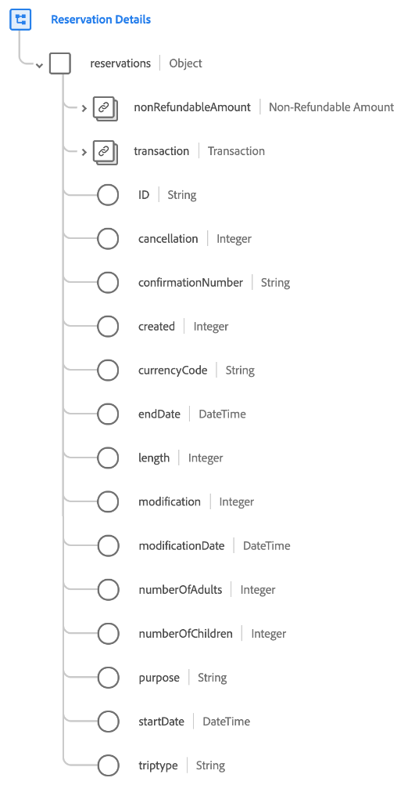

# [!UICONTROL Reservation Details] schema field group

[!UICONTROL Reservation Details] is a standard schema field group for the [[!DNL XDM ExperienceEvent] class](../../classes/experienceevent.md) used to capture information regarding a reservation, including length, modification, refundable status, and number of rooms.

The field group provides a single object-type field, `reservations`. The properties contained in this object are explained below.

| Property | Data type | Description |
| --- | --- | --- |
| `nonRefundableAmount` | [Currency](../../data-types/currency.md) | The amount of the reservation price that is marked as non-refundable. |
| `transaction` | [Transaction](../../data-types/transaction.md) | Describes the currency transaction for the reservation. |
| `id` | String | A unique identifier for the reservation. |
| `cancellation` | Integer | This value is captured when a reservation has been cancelled. |
| `confirmationNumber` | String | The confirmation number or identifier for the reservation. |
| `created` | Integer | This value is captured when the reservation has been created. |
| `currencyCode` | String | The ISO 4217 currency code used to make the purchase. |
| `endDate` | DateTime | The end drop-off, return, or check-out date for the reservation. |
| `length` | Integer | The total number of days for the reservation. |
| `modification` | Integer | This value is captured when a reservation has been modified. |
| `modificationDate` | DateTime | The time when the reservation was last modified. |
| `numberOfAdults` | Integer | The number of adults associated with the reservation. |
| `numberOfChildren` | Integer | The number of children associated with the reservation. |
| `purpose` | String | The purpose of the reservation, typically either business or personal. |
| `startDate` | DateTime | The start pick-up, outbound, or check-in date for the reservation. |
| `triptype` | String | Indicates if the reservation is for a one-way trip, a round trip, or a multi-city trip. |

{style="table-layout:auto"}

For more details on the field group, refer to the public XDM repository:

* [Populated example](https://github.com/adobe/xdm/blob/master/components/fieldgroups/experience-event/industry-verticals/experienceevent-reservation-details.example.1.json)
* [Full schema](https://github.com/adobe/xdm/blob/master/components/fieldgroups/experience-event/industry-verticals/experienceevent-reservation-details.schema.json)

## Industry-specific reservation field groups

There are several other standard field groups that extend the [!UICONTROL Reservation Details] schema for industry-specific use cases. Refer to the following documentation for more details:

* [[!UICONTROL Dining Reservation]](./dining-reservation.md)
* [[!UICONTROL Flight Reservation]](./flight-reservation.md)
* [[!UICONTROL Lodging Reservation]](./lodging-reservation.md)
