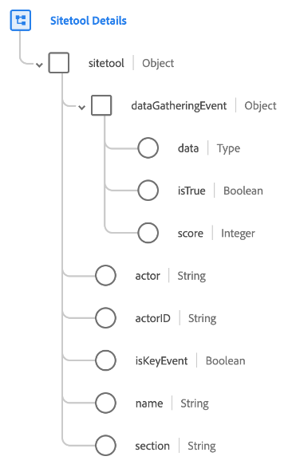

# [!UICONTROL Sitetool Details] schema field group

[!UICONTROL Sitetool Details] is a standard schema field group for the [[!DNL XDM ExperienceEvent] class](../../classes/experienceevent.md). The field group provides a single `sitetool` object to a schema, which captures information collected by a sitetool.

| Property | Data type | Description |
| --- | --- | --- |
| `dataGatheringEvent` | Object | Indicates whether this event is a data-gathering event along with other related details. Contains the following properties:<ul><li>`data`: (Map) Contains the JSON data that is collected and submitted as part of quiz, survey, or poll submit event.</li><li>`isTrue`: (Boolean) Indicates whether this event is a data-gathering event like quiz, survey, or poll.</li><li>`score`: (Integer) The score secured by the actor based on event responses.</li></ul> |
| `actor` | String | A person/member who did the action. |
| `actorID` | String | A unique identifier for person/member who did the action. |
| `isKeyEvent` | Boolean | Indicates whether this event is a key event. |
| `name` | String | The name of the sitetool, such as chatbot, survey, and so on. |
| `section` | String | The relevant section of the sitetool like main or sub. |

{style="table-layout:auto"}

For more details on the field group, refer to the [public XDM repository](https://github.com/adobe/xdm/blob/master/components/fieldgroups/experience-event/industry-verticals/experienceevent-healthcare-sitetool.schema.json).
