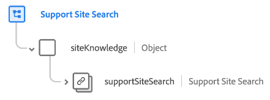

# [!UICONTROL Support Site Search] schema field group

[!UICONTROL Support Site Search] is a standard schema field group for the [[!DNL XDM ExperienceEvent] class](../../classes/experienceevent.md). It provides a single `siteKnowledge.supportSiteSearch` object to a schema which captures information about a support site search.

| Property | Data type | Description |
| --- | --- | --- |
| `supportSiteSearch` | [[!UICONTROL Internal Site Search]](../../data-types/internal-site-search.md) | Captures the details about the search event. |

{style="table-layout:auto"}

For more details on the field group, refer to the [public XDM repository](https://github.com/adobe/xdm/blob/master/docs/reference/fieldgroups/experience-event/experienceevent-support-site-search.schema.json).
