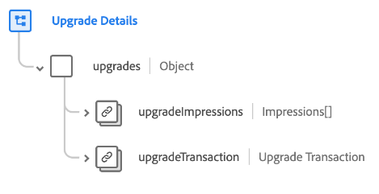

# [!UICONTROL Upgrade Details] schema field group

[!UICONTROL Upgrade Details] is a standard schema field group for the [[!DNL XDM ExperienceEvent] class](../../classes/experienceevent.md) used to capture information regarding an upgrade marketing event, including details about the transaction and the different ways the offer was displayed to a customer.

The field group provides a single object-type field, `upgrades`. The properties contained in this object are explained below.

| Property | Data type | Description |
| --- | --- | --- |
| `upgradeImpressions` | Array of [Impressions](../../data-types/impressions.md) | An array that lists the recorded impressions (digital views or engagements with the upgrade offer) for the customer. |
| `upgradeTransaction` | [Transaction](../../data-types/transaction.md) | Describes the currency transaction for the upgrade. |

{style="table-layout:auto"}

For more details on the field group, refer to the public XDM repository:

* [Populated example](https://github.com/adobe/xdm/blob/master/components/fieldgroups/experience-event/industry-verticals/experienceevent-upgrade-details.example.1.json)
* [Full schema](https://github.com/adobe/xdm/blob/master/components/fieldgroups/experience-event/industry-verticals/experienceevent-upgrade-details.schema.json)
