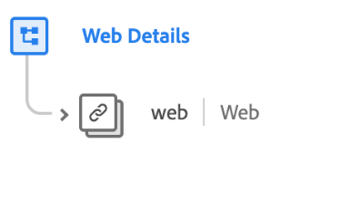

# [!UICONTROL Web Details] schema field group

>[!NOTE]
>
>The names of several schema field groups have changed. See the document on [field group name updates](../name-updates.md) for more information.

[!UICONTROL Web Details] is a standard schema field group for the [[!DNL XDM ExperienceEvent] class](../../classes/experienceevent.md), used to describe information regarding web details events such as interaction, page details, and referrer.

| Property | Data type | Description |
| --- | --- | --- |
| `web` | [Web information](../../data-types/web-information.md)  | Describes link clicks, web page details, referrer information, and browser details. |

{style="table-layout:auto"}

For more details on the field group, refer to the public XDM repository:

* [Populated example](https://github.com/adobe/xdm/blob/master/components/fieldgroups/experience-event/experienceevent-web.example.1.json)
* [Full schema](https://github.com/adobe/xdm/blob/master/components/fieldgroups/experience-event/experienceevent-web.schema.json)
