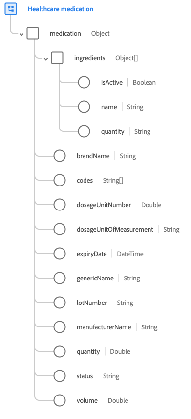

# [!UICONTROL Healthcare medication] schema field group

[!UICONTROL Healthcare medication] is a standard schema field group for the [[!UICONTROL Medication] class](../../classes/medication.md). It provides a single object-type field `medication` which captures details such as brand name, lot number, and quantity.

| Property | Data type | Description |
| --- | --- | --- |
| `ingredients` | Array of objects | Lists the ingredients present in the medication. Each object includes the following properties: <ul><li>`isActive`: (Boolean) Indicates whether this ingredient is still actively used in this medication.</li><li>`name`: (String) The name of the ingredient.</li><li>`quantity`: (String) The quantity of the ingredient present in the medication.</li></ul> |
| `brandName` | String | The brand name of the drug. |
| `codes` | Array of strings | A list of codes that identify this medication. |
| `dosageUnitNumber` | Double | The dosage unit number for the medication. |
| `dosageUnitOfMeasurement` | String | The unit of measurement for the dosage number. |
| `expiryDate` | DateTime | Expiry date of the medication. |
| `genericName` | String | The generic name of the drug. |
| `lotNumber` | String | The unique identifier for the drug's batch. |
| `manufacturerName` | String | The drug manufacturer's name. |
| `quantity` | Double | The amount of drug in the package. |
| `status` | String | A general status indicating whether the drug/medication is active or not. |
| `volume` | Double | The volume of the drug. |

{style="table-layout:auto"}

For more details on the field group, refer to the [public XDM repository](https://github.com/adobe/xdm/blob/master/components/fieldgroups/medication/healthcare-medication.schema.json).
