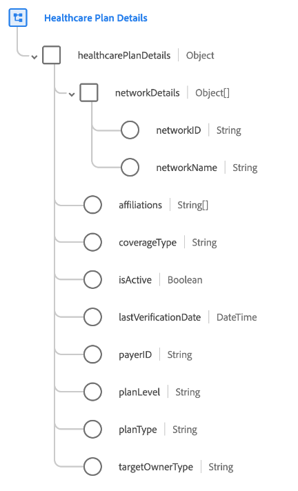

# [!UICONTROL Healthcare Plan Details] schema field group

[!UICONTROL Healthcare Plan Details] is a standard schema field group for the [[!UICONTROL Plan] class](../../classes/plan.md). It provides a single object-type field `healthcarePlanDetails` which captures properties related to a medical plan.

| Property | Data type | Description |
| --- | --- | --- |
| `networkDetails` | Array of objects | Lists the details of the insurer-defined network(s) of providers to which the beneficiary may seek treatment, and will be covered at the "in-network" rate. Each object includes the following properties: <ul><li>`networkID`: (String) The insurer-specific ID for the network.</li><li>`networkName`: (String) The insurer-specific name for the network.</li></ul> |
| `affiliations` | Array of strings | A list of business entities that are affiliated with the plan. |
| `coverageType` | String | The plan coverage type. Accepted values are:<ul><li>`medical`</li><li>`dental`</li><li>`vision`</li><li>`accident`</li></ul> |
| `isActive` | Boolean | Indicates whether the plan is active. |
| `lastVerificationDate` | DateTime | The date on which the plan was last verified. |
| `payerID` | String | The unique identifier for the payer (in other words, the insurance provider for the plan). |
| `planLevel` | String | Indicates the plan level. Accepted values are:<ul><li>`primary`</li><li>`secondary`</li><li>`tertiary`</li><li>`quaternary`</li></ul> |
| `planType` | String | Indicates the plan type. Accepted values are:<ul><li>`hmo`</li><li>`epo`</li><li>`pos`</li><li>`hdhp`</li></ul> |
| `targetOwnerType` | String | The type of owner a plan is for. Examples include individual, group, organization, and so on. |

{style="table-layout:auto"}

For more details on the field group, refer to the [public XDM repository](https://github.com/adobe/xdm/blob/master/docs/reference/fieldgroups/plan/healthcare-plan-details.schema.json).
