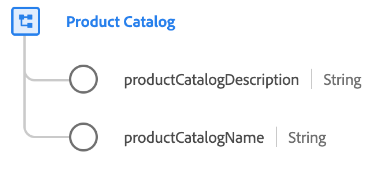

# [!UICONTROL Product Catalog] schema field group

[!UICONTROL Product Catalog] is a standard schema field group for the [[!UICONTROL Product] class](../../classes/product.md) which captures properties related to a product catalog.

| Property | Data type | Description |
| --- | --- | --- |
| `productCatalogDescription` | String | A description for the product catalog. |
| `productCatalogName` | String | The name of the product catalog. |

{style="table-layout:auto"}

For more details on the field group, refer to the [public XDM repository](https://github.com/adobe/xdm/blob/master/docs/reference/fieldgroups/product/product-catalog.schema.json).
