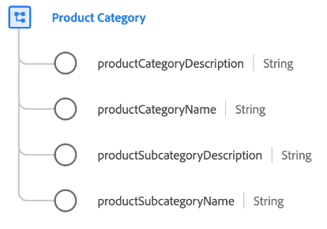

# [!UICONTROL Product Category] schema field group

[!UICONTROL Product Category] is a standard schema field group for the [[!UICONTROL Product] class](../../classes/product.md) which captures properties related to the category of a product.

| Property | Data type | Description |
| --- | --- | --- |
| `productCategoryDescription` | String | A description for the product category. |
| `productCategoryName` | String | The name of the product category. |
| `productSubcategoryDescription` | String | A description for the product subcategory. |
| `productSubcategoryName` | String | The name of the product subcategory. |

{style="table-layout:auto"}

For more details on the field group, refer to the [public XDM repository](https://github.com/adobe/xdm/blob/master/docs/reference/fieldgroups/product/product-category.schema.json).
