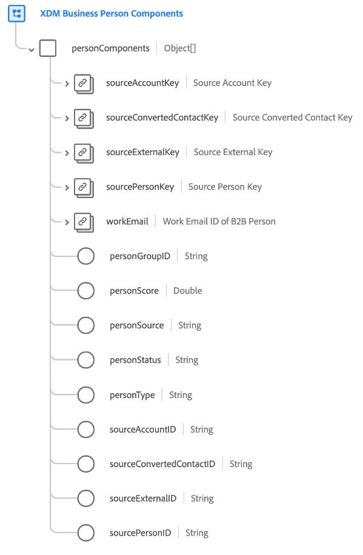

# [!UICONTROL XDM Business Person Components] schema field group

[!UICONTROL XDM Business Person Components] is a standard schema field group for the [[!DNL XDM Individual Profile] class](../../classes/individual-profile.md) that captures multiple source records for a person, and other attributes which are required for person segmentation.

When a profile is created for a person through [Real-Time Customer Profile](../../../profile/home.md) in the B2B edition of Real-Time CDP, the information used to create that profile may potentially come from many source records. For example, if a person works for two different companies, many CRM systems would create an intentionally duplicate copy of that person so that one copy is linked to Company A, while the other is linked to Company B. When bringing that data into Adobe Experience Platform, this field group is used to merge those different source records into a single representation.

The field group provides a root-level `personComponents` field, which is an array of objects. Each object in the array represents a different source record.

>[!IMPORTANT]
>
>You must follow the ingestion patterns as described in the [sources documentation](../../../rtcdp/sources/b2b.md). Other field mapping methods are not guaranteed to work.
>
>For example, each object of the `personComponents` array is submitted individually during standard ingestion patterns and then added to the array by Platform. Manually adding an array of objects to the Business Person Component will return an error.
>You should use the auto-generation utility when creating schemas for your B2B data. See the documentation for instructions on how to use the [B2B namespace and schema auto-generation utility](../../../sources/connectors/adobe-applications/marketo/marketo-namespaces.md). If you are not using the auto-generation utility and intend to manually map your data model, be sure to read the documentation on the [Adobe Real-Time Customer Data Platform B2B Edition XDM classes](../../../rtcdp/schemas/b2b.md) before mapping your data.
>
>See the [end-to-end tutorial](../../../rtcdp/b2b-tutorial.md) for information on recommended workflows for B2B data. 

| Property | Data type | Description |
| --- | --- | --- |
| `sourceAccountKey` | [[!UICONTROL B2B Source]](../../data-types/b2b-source.md) | A composite identifier for the account associated with the person. |
| `sourceConvertedContactKey` | [[!UICONTROL B2B Source]](../../data-types/b2b-source.md) | A composite identifier for the related contact if this lead was converted. |
| `sourceExternalKey` | [[!UICONTROL B2B Source]](../../data-types/b2b-source.md) | A composite identifier for the source system the person's data originated from. |
| `sourcePersonKey` | [[!UICONTROL B2B Source]](../../data-types/b2b-source.md) | A composite identifier for the person. |
| `workEmail` | [[!UICONTROL Email address]](../../data-types/b2b-source.md) | The work email ID of the person. |
| `personGroupID` | String | A group identifier for the person. |
| `personScore` | String | A score generated for the person by a CRM system. |
| `personSource` | String | A unique string-based identifier for the source system the person's data originated from. |
| `personStatus` | String | The current marketing or sales status of the person. |
| `personType` | String | The type of person in a B2B context. |
| `sourceAccountID` | String | A unique string-based identifier for the account in the source system associated with the person. This field is used as a foreign key by the system to look up the different companies that this person works for. |
| `sourceConvertedContactID` | String | A unique string-based identifier for the related contact if this lead was converted. |
| `sourceExternalID` | String | A unique string-based identifier for the source system that the person's data originated from. |
| `sourcePersonID` | String | A unique string-based identifier for the person. |

{style="table-layout:auto"}

For more details on the field group, refer to the public XDM repository:

* [Populated example](https://github.com/adobe/xdm/blob/master/components/fieldgroups/profile/b2b-person-components.example.1.json)
* [Full schema](https://github.com/adobe/xdm/blob/master/components/fieldgroups/profile/b2b-person-components.schema.json)
